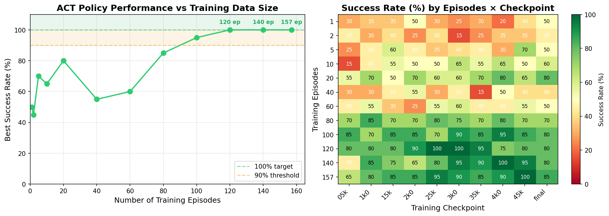
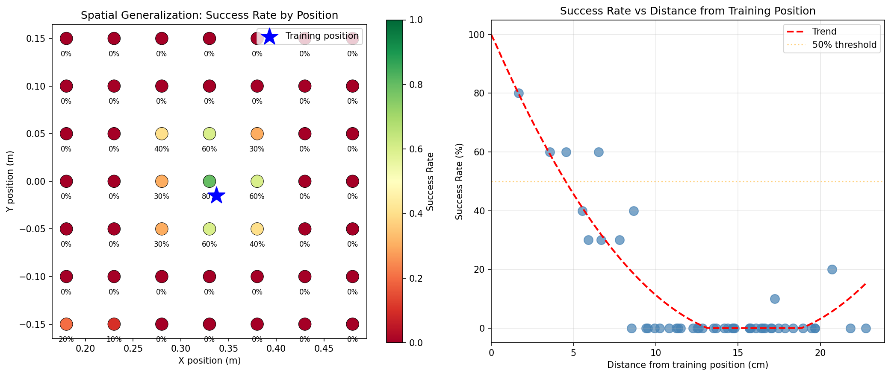
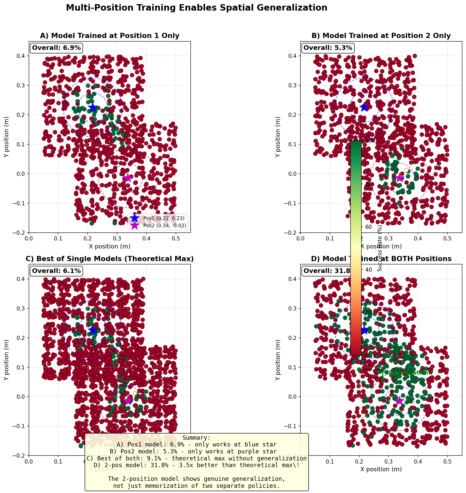
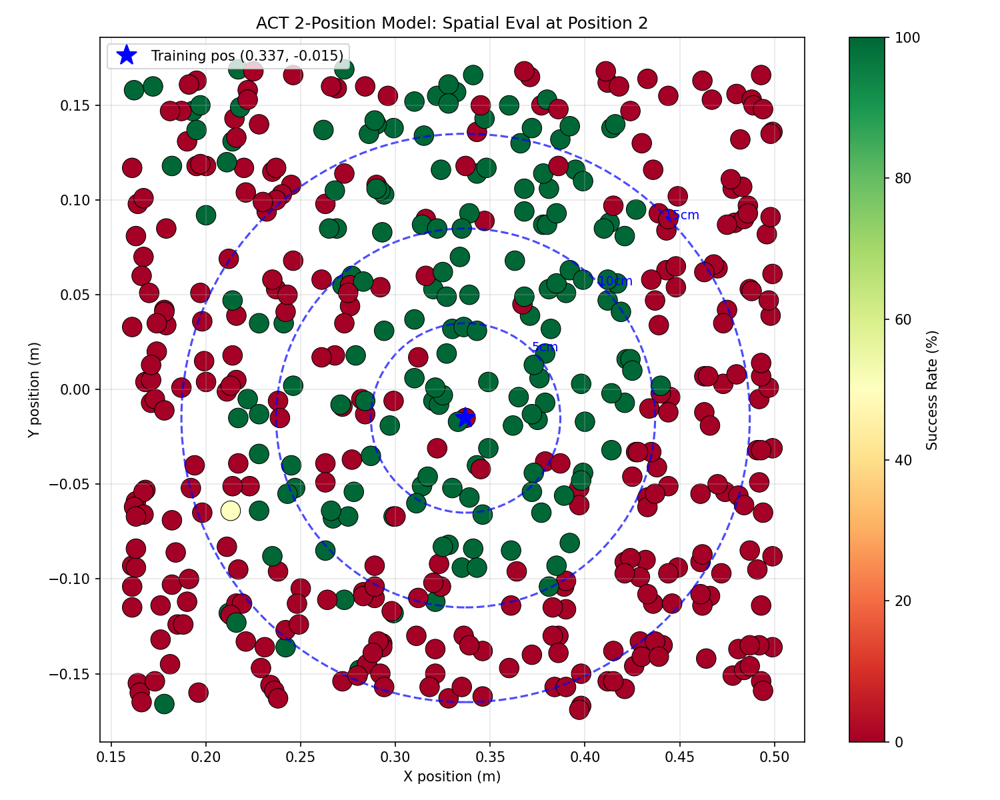

# Experiments Log

## TODO: Follow-up Required

### ACT Model - 100k steps (2026-01-05)
- **Model**: `danbhf/act_sim_pick_place_100k`
- **Dataset**: `danbhf/sim_pick_place_40ep_rgbd_ee`
- **Training**: 100k steps, ~510 minutes on vast.ai
- **Best loss**: 0.0307
- **WandB**: https://wandb.ai/bryars-bryars/lerobot-thesis/runs/c3jay0gt
- **Status**: Training complete, uploaded to HF
- **TODO**: Run evaluation in simulation to measure success rate

### SmolVLA Model - 200k steps (2026-01-06) [FAILED - 0% SUCCESS]
- **Model**: `danbhf/smolvla_sim_pick_place_200k`
- **Dataset**: `danbhf/sim_pick_place_40ep_rgbd_ee` (RGBD + EE space)
- **Training**: 200k steps on H100
- **Evaluation**: 0% success across ALL checkpoints (10k through 200k)
- **Status**: Complete failure - needs investigation

**Possible causes (unknown which):**
1. SmolVLA training didn't work well, inference code is fine
2. Training worked, inference code is broken
3. Both training and inference are broken

**Complicating factors:**
- Used EE action space (8-dim) with IK conversion - known to have ~28% IK failure rate
- Used RGBD cameras - FOV mismatch issues between scenes (58° vs 52°)
- Models from HuggingFace may differ from original source
- No baseline comparison (SmolVLA hasn't been validated on this task before)

**Next steps:**
- Simplify: Train SmolVLA with joint space (6-dim) + RGB only (no depth)
- Use `danbhf/sim_pick_place_merged_40ep` dataset (correct FOV, joint actions)
- Compare against known-working ACT joint-space baseline (73.3% success)

### SmolVLA Model - Joint Space (2026-01-08) [FAILED - 0% SUCCESS]
- **Model**: `danbhf/smolvla_so101_200k`
- **Dataset**: `danbhf/sim_pick_place_merged_40ep` (RGB + joint space)
- **Training**: 200k steps on H100
- **Evaluation** (2026-01-10): 0% success across ALL checkpoints (2k through 200k)
- **Status**: Complete failure - same as EE-space version

**Evaluation Results:**
| Checkpoint | Success Rate |
|------------|-------------|
| checkpoint_002000 | 0.0% |
| checkpoint_004000 | 0.0% |
| checkpoint_006000 | 0.0% |
| checkpoint_008000 | 0.0% |
| checkpoint_010000 | 0.0% |
| checkpoint_012000 | 0.0% |
| checkpoint_014000 | 0.0% |
| checkpoint_016000 | 0.0% |
| checkpoint_018000 | 0.0% |
| checkpoint_020000 | 0.0% |
| final | 0.0% |

**Failure mode**: All episodes result in "never_picked_up" - the robot doesn't attempt to grasp.

**Baseline comparison**: ACT joint-space model achieves 80% success on same task, confirming eval infrastructure works.

**Conclusion**: SmolVLA training is not working for this task. Issue is NOT the action space (tried both EE and joint), NOT the dataset format. Likely a fundamental issue with SmolVLA training or inference code.

### Pi0 Model - 40k Training Attempt (2026-01-11) [FAILED - DISK FULL x2]
- **Attempted**: 40k steps to see if longer training helps
- **Failed at**: Step 10000 with "No space left on device"
- **Root cause**: vast.ai instance had NO usable large disk - only 50GB overlay

**What went wrong:**
- `df -h` showed 2TB disks, but they were read-only nvidia driver mounts
- `/workspace` was on the same 50GB overlay as `/`, not a separate disk
- Symlink trick didn't help because there was no actual large disk to symlink to

**vast.ai Disk Verification Checklist (DO THIS BEFORE TRAINING):**
```bash
# 1. Check total disk space
df -h

# 2. CRITICAL: Verify /workspace (or /data) is on a SEPARATE large disk
df -h /workspace
# BAD: Shows "overlay" filesystem → it's on the small Docker disk
# GOOD: Shows "/dev/sda1" or similar → it's a real separate disk

# 3. If /workspace is on overlay, look for actual large disk:
mount | grep -v "tmpfs\|proc\|sys\|nvidia\|loop"
# Look for a large ext4 mount you can write to

# 4. Test write access to the large disk:
touch /path/to/large/disk/test && rm /path/to/large/disk/test

# 5. Estimate storage needed:
#    - Pi0 checkpoints: ~13GB each (train_state + params + assets)
#    - 40k steps with save_interval=5000 → 8 checkpoints → ~100GB needed
#    - 40k steps with save_interval=10000 → 4 checkpoints → ~50GB needed
```

**When renting vast.ai instance:**
- Look for "Disk Space" in the listing - ensure it's >100GB
- Prefer instances that explicitly show disk mounted at `/workspace` or `/data`
- After connecting, ALWAYS run the verification checklist above

**Training command (once disk is verified):**
```bash
cd /app/openpi

# Symlink checkpoints to large disk (replace /data with actual mount point)
rm -rf checkpoints && ln -s /data/checkpoints checkpoints
mkdir -p /data/checkpoints

# Run training
XLA_PYTHON_CLIENT_MEM_FRACTION=0.9 uv run scripts/train.py pi0_so101 \
    --exp-name=pi0_so101_40k \
    --num-train-steps=40000 \
    --save-interval=10000 \
    --overwrite
```

### ACT Model - 157 Episodes (2026-01-18) [SUCCESS - 100% at 45k]
- **Dataset**: `danbhf/sim_pick_place_157ep` (157 episodes, joint space)
- **Training**: 50k steps, ~2 hours locally on RTX 5090
- **Best checkpoint**: `checkpoint_045000` - **100% success** (10/10 episodes)
- **Final checkpoint**: `checkpoint_050000` - 80% success (dropped during transport)
- **Best loss**: 0.0633
- **WandB**: https://wandb.ai/bryars-bryars/lerobot-thesis/runs/17akuj2p

**Checkpoint performance:**
| Checkpoint | Success Rate | Notes |
|------------|-------------|-------|
| 040000 | 60% | 3 dropped, 1 missed |
| 045000 | **100%** | Perfect run! |
| 050000 | 80% | 2 dropped (slight overfit) |

**Key finding**: 157 episodes (4x more data) improved ACT from 73% → 100% success.
The model peaks around 45k steps, slight overfitting after that.

---

### Pi0 Model - LeRobot PyTorch (2026-01-18/19) [SUCCESS - TRAINED]
- **Docker image**: `aerdanielbryars101/lerobot-pi0:latest`
- **Dataset**: `danbhf/sim_pick_place_157ep` (157 episodes, joint space)
- **Training**: vast.ai H100, ~1.3s/step with gradient checkpointing

**Models trained:**

| Model | Steps | Final Loss | Training Time | HuggingFace |
|-------|-------|------------|---------------|-------------|
| Pi0 5K | 5,000 | 0.032 | ~1.5 hours | `danbhf/pi0_so101_lerobot` |
| Pi0 20K | 20,000 | ~0.025 | ~7 hours | `danbhf/pi0_so101_lerobot_20k` |

**Training metrics (20K run):**
- Loss: Started ~0.25, dropped to ~0.05 by 5K, settled ~0.025 by 20K
- grad_norm: Stable around 1.2-1.4 throughout
- Learning rate: Decayed from 2.5e-05 to 2.5e-06
- Loss curve was noisy after initial drop (normal for small dataset fine-tuning)

**Key observations:**
- 20K model achieved lower loss than 5K (0.025 vs 0.032)
- Training stable throughout, no exploding gradients
- Model size: 7.01GB (safetensors format)
- TODO: Run inference evaluation to compare 5K vs 20K success rates

**Training command:**
```bash
DATASET=danbhf/sim_pick_place_157ep STEPS=20000 BATCH_SIZE=32 \
    JOB_NAME=pi0_so101_20k REPO_ID=danbhf/pi0_so101_lerobot_20k bash /app/train.sh
```

**Inference test (2026-01-19) - SUCCESS (loads, but 0% eval initially):**
Both models load and produce valid actions on H100, but initial simulation evaluation showed 0% success:

| Model | Action Range | Inference Speed |
|-------|-------------|-----------------|
| 5K (`danbhf/pi0_so101_lerobot`) | -0.87 to 0.92 | 824 Hz (1.2ms) | H100 |
| 20K (`danbhf/pi0_so101_lerobot_20k`) | -1.36 to 1.40 | 802 Hz (1.2ms) | H100 |
| 20K (`danbhf/pi0_so101_lerobot_20k`) | -1.18 to 0.81 | 803 Hz (1.2ms) | RTX 5090 |

Benchmark script: `scripts/pi0/test_pi0_inference.py`

- 20K model has larger action range - may indicate more decisive actions
- Both models extremely fast on H100 (~800 Hz)
- Tied weights warning (`embed_tokens.weight`) is safe to ignore

**Initial simulation evaluation (2026-01-19) - 0% SUCCESS:**
- Both 5K and 20K models fail all episodes in simulation
- Models load correctly and produce actions at 800+ Hz
- Actions appear to be in reasonable range but robot does not complete task

**Whisker visualization diagnosis (2026-01-19):**
- Used `visualize_whiskers_pi0.py` to see what model is predicting
- **Result**: Pi0 predicts chaotic, random movements near starting position
- Whiskers show tiny perturbations, NOT purposeful trajectories toward block
- Compare to ACT which shows smooth arcs toward the target
- **Conclusion**: Pi0 has NOT learned the task - outputs are essentially noise
- See screenshot: `CameraShapshots/Pi0 Fail does not move.png`

**Root cause hypothesis:**
1. **Insufficient data**: 157 episodes may not be enough for Pi0's 3B parameters
2. **Missing preprocessing**: Pi0 may need specific image normalization we're not applying
3. **Action space mismatch**: Pi0 base expects different action format than our joint positions
4. **Training issue**: The remote training may have had issues we didn't catch

---

### Whisker Visualization for Policy Debugging (2026-01-19)

**Problem:** Pi0 models produce valid-looking actions but achieve 0% success in simulation.
Need to understand what the model is actually predicting at each timestep.

**Idea:** Visualize predicted action trajectories as "whiskers" - faint lines emanating from
the robot end-effector showing the predicted future path at each timestep.

**Why this is useful:**
1. **Policy uncertainty made visible** - See where the policy is confident vs hesitant
2. **Action-chunk structure observable** - See chunk smoothness, mode collapse, multi-modal futures
3. **Sim-to-real diagnostics** - Wide whiskers = brittle policy, narrow bundles = robust
4. **Compare policy heads** - ACT vs Pi0 diffusion vs Pi0 flow matching

**Implementation:** `scripts/tools/visualize_whiskers.py`
- Forward-simulate action chunks in a copy of MuJoCo state
- Render predicted EE positions as faded capsule segments
- Works with ACT (known working) first, then extend to Pi0

**Academic framing:** "3D uncertainty-aware policy rollout visualization for VLA models"
- Reveals temporal confidence structure of learned policies
- Highlights multi-modal futures under partial observability
- Provides qualitative safety and robustness diagnostics

**Status:** Working for ACT, extended to Pi0

**Scripts:**
- `scripts/tools/visualize_whiskers_act.py` - ACT policy visualization
- `scripts/tools/visualize_whiskers_pi0.py` - Pi0 policy visualization

**Features:**
- Green whiskers: Current prediction (full action chunk forward-simulated)
- Blue ghost trails: Past predictions (fading with age)
- Orange line: Actual path robot took
- Interactive controls: SPACE pause, LEFT/RIGHT step through history
- History playback: Rewind to see exact state at each timestep
- **Joint Graph** (opt-in with `--show-joint-graph`): Real-time matplotlib plots showing
  all 6 joint predictions over the action chunk horizon. Critical for diagnosing
  action scale mismatches between models.

**Key findings from ACT visualization:**
- ACT predicts smooth, purposeful trajectories toward the target
- Predictions align well with actual path taken
- Model constantly re-predicts (visual servoing with learned intent)
- Only first action is executed, rest shows "plan"

**Key findings from Pi0 visualization - Initial (2026-01-19):**
- Pi0 whiskers show chaotic, random movements near starting position
- Model is NOT predicting purposeful trajectories toward block
- Predictions are essentially noise - small random perturbations
- This explains 0% success rate: model hasn't learned the task at all

**ROOT CAUSE FOUND - Action Normalization (2026-01-19):**

Comparing joint prediction graphs revealed the issue:
- **ACT predictions**: Large values like -40 to +40 (degrees)
- **Pi0 predictions**: Tiny values like -0.8 to +0.8 (normalized)

**The problem:** Pi0 outputs **normalized actions** (roughly -1 to 1 range) that need to be
**unnormalized** using a postprocessor. We were sending normalized values directly to the robot.

**The fix:** Apply `postprocessor` to denormalize actions before sending to robot:
```python
from lerobot.policies.factory import make_pre_post_processors

# Load postprocessor
preprocessor, postprocessor = make_pre_post_processors(
    policy.config, pretrained_path=checkpoint_path
)

# Apply to robot control actions
with torch.no_grad():
    action = policy.select_action(batch)
if postprocessor is not None:
    action = postprocessor(action)  # Denormalize!
action = action.cpu().numpy().flatten()
```

**Result after fix:** Robot now moves and heads towards the goal! The whisker predictions
now show purposeful trajectories (large degrees) instead of tiny normalized values.

**Status:** Robot moving towards goal but not yet successfully completing task (0/5 TIMEOUT).
This is a significant milestone - tagged as **V0.1**

### Pi0 vs ACT Control Rate Analysis (2026-01-20)

**Timing comparison with whisker visualization:**

| Metric | ACT | Pi0 | Ratio |
|--------|-----|-----|-------|
| Loop time | ~40ms (25 Hz) | ~260ms (4 Hz) | 6.5x slower |
| Whiskers (action chunk) | ~31ms | ~250ms | 8x slower |
| Policy (select_action) | ~1.7ms | ~2ms | Similar |
| Chunk exhaustion spike | ~15ms | ~240ms | 16x slower |

**Key finding:** Pi0's action chunk inference (`predict_action_chunk`) is ~8x slower than ACT's.
This is expected - Pi0 is a 3B parameter VLM while ACT is a small transformer.

**Impact on control:**
- ACT runs at ~25 Hz effective control with whisker visualization
- Pi0 runs at ~4 Hz effective control with whisker visualization
- At 4 Hz, the robot can't react fast enough to visual feedback
- This causes overshoot/correction cycles ("elastic band" effect)

**Solution:** Added `--no-whiskers` flag to `visualize_whiskers_pi0.py` to disable
whisker computation during evaluation. Without whiskers, Pi0 should run at ~500 Hz
(based on `select_action` taking ~2ms).

**Benchmark script timing added:** `scripts/pi0/test_pi0_inference.py`

### Pi0 "Almost Works" Investigation (2026-01-20)

**Observation:** Pi0 consistently moves toward the goal but doesn't complete the task (0/5 TIMEOUT).
Robot gets close to the block but doesn't quite reach/grasp it - like an "elastic band" pulling it back.

**Ruled out:**
- ❌ Whisker visualization overhead (same behavior with `--no-whiskers`)
- ❌ Control rate (physics is paused during inference, timing doesn't affect behavior)
- ❌ Missing postprocessor (fixed - actions now denormalized properly)
- ❌ Cameras not being used (blinded both cameras - similar behavior, so model IS using vision)

**Camera blinding test results:**
- `--blind-camera none`: Moves toward goal, doesn't complete
- `--blind-camera overhead`: Similar behavior
- `--blind-camera wrist`: Similar behavior
- `--blind-camera both`: Still moves in same general pattern (!!)

This is actually encouraging - the model learned SOMETHING from vision during training, but at inference
the proprioceptive state alone seems to drive most of the behavior. Or the vision features are
so entangled in the model that even black images produce similar activations.

### ACT vs Pi0 Action Chunking - Key Architectural Difference

**The code is IDENTICAL** - both policies use the same queue-based action selection:
```python
def select_action(self, batch):
    if len(self._action_queue) == 0:
        actions = self.predict_action_chunk(batch)[:, :self.config.n_action_steps]
        self._action_queue.extend(actions.transpose(0, 1))
    return self._action_queue.popleft()
```

**The difference is in CONFIG VALUES:**

| Parameter | ACT (default) | ACT (temporal ensemble) | Pi0 (our config) |
|-----------|---------------|-------------------------|------------------|
| chunk_size | 100 | 100 | 50 |
| n_action_steps | 100 | 1 | 50 |
| temporal_ensemble | None | 0.01 | N/A |
| Re-predict frequency | Every 100 steps | EVERY step | Every 50 steps |

**ACT has two operating modes:**

1. **Without temporal ensemble** (default): Predicts 100 actions, executes ALL 100, then re-predicts.
   Same as Pi0 - fully "open loop" within each chunk.

2. **With temporal ensemble** (`temporal_ensemble_coeff=0.01`):
   - `n_action_steps` MUST be 1
   - Predicts a NEW full chunk EVERY SINGLE STEP
   - Blends overlapping predictions with exponential weighting
   - This is the "visual servoing" effect - constantly re-evaluating
   - Default weight (0.01) favors older predictions (smoothing)

**Pi0:** No temporal ensemble option. Always commits to full chunk (50 steps) before re-predicting.

**Implication for debugging:**
If Pi0's initial prediction is slightly off, it commits to that trajectory for ~50 steps without
correction. ACT with temporal ensemble would correct every step. This could explain why Pi0
"almost works" - small initial errors compound without correction.

**Possible solutions:**
1. ~~Reduce Pi0's `n_action_steps` (e.g., 10) to re-predict more often~~ **WON'T WORK - see below**
2. ~~Implement temporal ensemble for Pi0~~ **WON'T WORK - see below**
3. More training data to improve initial predictions
4. Check if whiskers show prediction error accumulating over the chunk

### Why Pi0 Can't Do Frequent Re-prediction (Fundamental Trade-off)

**Inference timing comparison:**

| Model | predict_action_chunk | select_action (from queue) |
|-------|---------------------|---------------------------|
| ACT | ~31ms | ~1.7ms |
| Pi0 | ~250ms | ~2ms |

**If we reduce n_action_steps to 1 (re-predict every step):**
- ACT: 31ms/step = **32 Hz** ✓ (viable for real-time control)
- Pi0: 250ms/step = **4 Hz** ✗ (too slow for reactive control)

**This is a fundamental architectural trade-off:**
- **ACT**: Small transformer (~few M params), fast inference → CAN do temporal ensemble / visual servoing
- **Pi0**: Large VLM (3B params), slow inference → MUST commit to longer action chunks

The 50-step chunking in Pi0 isn't a bug - it's **necessary** to amortize the slow inference cost.
Pi0 achieves ~500 Hz effective control by predicting 50 actions in 250ms, then executing them
quickly from the queue. But this means it can only "see" and react every 50 steps.

**The real question becomes:** Can a VLM predict accurately enough 50 steps into the future
that it doesn't need frequent visual feedback? Or is the task too dynamic for open-loop chunks?

**Implications for VLMs in robotics:**
- VLMs may be better suited for **high-level planning** (what to do) than **low-level control** (how to do it)
- Hybrid approaches: VLM for goal/waypoint generation, small policy for reactive execution
- Or: Accept lower control rates for tasks where 4 Hz is sufficient (slow manipulation)
- Or: Distill VLM knowledge into smaller, faster models for deployment

**Possible causes still to investigate:**
1. **Delta vs absolute actions** - Pi0 base might expect delta actions but we're treating as absolute?
2. **Camera mismatch** - Pi0 base trained on `base_0_rgb`, `left_wrist_0_rgb`, `right_wrist_0_rgb`
   but our dataset has `overhead_cam`, `wrist_cam` - fine-tuning may not fully adapt
3. **Image preprocessing** - Different normalization or resolution handling
4. **Gripper action range** - Original Pi0 expects [0,1] gripper, our data might be different
5. **More fine-tuning needed** - 20K steps may not be enough to override base model biases

**Next steps:**
- ~~Try reducing `n_action_steps` in Pi0 config to re-predict more frequently~~ **SEE RESULTS BELOW**
- Compare action ranges between ACT (working) and Pi0 (not working)
- Watch whiskers to see if error accumulates over a chunk
- Try longer training (40K+ steps)

### ACT Rollout Length Experiment (2026-01-20)

**Question:** Does reducing `n_action_steps` (re-predicting more often) help or hurt performance?

**Setup:**
- Model: `act_20260118_155135/checkpoint_045000` (100% success with default settings)
- chunk_size=100 (fixed - this is how many actions the model predicts)
- n_action_steps=varied (how many to execute before re-predicting)
- 10 episodes per setting

**Results:**

| n_action_steps | Success Rate | Avg Steps | Avg Time | Notes |
|----------------|--------------|-----------|----------|-------|
| 1 | **0%** | 300.0 | 5.78s | Too much jitter - constant re-prediction destabilizes |
| 2 | **0%** | 300.0 | 3.51s | Still too frequent |
| 5 | **0%** | 300.0 | 2.10s | Still failing |
| 10 | 80% | 187.3 | 1.00s | Starts working |
| **20** | **100%** | 134.9 | 0.63s | **OPTIMAL** - sweet spot! |
| 50 | 80% | 168.4 | 0.71s | Slightly worse |
| 100 | 90% | 151.0 | 0.61s | Good but not optimal |

**Key Findings:**

1. **There's an optimal rollout length** - not too short, not too long
   - Too short (1-5): Constant re-prediction causes jitter/instability, policy can't execute smooth trajectories
   - Too long (50-100): Commits too long to potentially suboptimal trajectories
   - Sweet spot (~20): Balance between reactivity and smoothness

2. **Frequent re-prediction HURTS performance** - contrary to "visual servoing" intuition
   - At n_action_steps=1, success drops from 100% to 0%
   - The noise from constant re-prediction overwhelms the benefits of visual feedback

3. **The 100-step default is actually suboptimal** for this task
   - 100 steps: 90% success
   - 20 steps: 100% success
   - Re-predicting every 20 steps (~0.67s at 30Hz) is better than every 100 steps (~3.3s)

4. **Timing shows re-prediction overhead**
   - n_action_steps=1: 5.78s for 300 steps = 19ms/step (constant inference)
   - n_action_steps=100: 0.61s for 151 steps = 4ms/step (rare inference)

**Implications for Pi0:**

Pi0 uses n_action_steps=50. Based on ACT results:
- 50 steps gave 80% for ACT, so might not be optimal
- But Pi0 CAN'T use smaller values due to slow inference (~250ms per chunk)
- If Pi0 used n_action_steps=20, it would need to infer every 20 steps
- At 250ms/inference, that's 250ms every 20 steps = 12.5ms overhead per step
- Still potentially viable, but pushing the limits

**Experiment script:** `scripts/experiments/test_act_chunking_rollout_length.py`

### Whisker Visualization Bug Fix (2026-01-20)

**Critical bug found:** Whiskers didn't match the actual robot trajectory!

**Root cause:** The visualizer was making a SEPARATE prediction call to show whiskers,
but the robot executed a DIFFERENT prediction due to VAE sampling randomness:

1. `update_whiskers()` called `predict_action_chunk()` → Prediction A (shown)
2. `policy.select_action()` called `predict_action_chunk()` → Prediction B (executed)

Since ACT uses VAE sampling, these predictions differ even with the same input!

**Fix:** Capture the ACTUAL actions from the policy's internal queue after `select_action()`
fills it, then forward simulate THOSE actions for whisker visualization.

**Additional fixes:**
- History now records every step (not just at re-prediction) for smooth playback
- History navigation: RIGHT at end exits to live mode
- History shows step number and position within chunk

**TODO - Multi-prediction visualization mode:**
Add a mode to show N predictions (e.g., 10) simultaneously to visualize model uncertainty.
Execute only the last prediction but show all trajectories overlaid. This would reveal:
- How consistent/uncertain the model is
- Whether the model has multimodal predictions
- Variance in the predicted trajectories

### Joint Position Tracking for Whisker Debugging (2026-01-20)

**Problem:** Whisker predictions still diverge from actual robot path even after fixing
the VAE sampling bug. Forward simulation in whiskers uses 1 `mj_step()` per action,
but actual physics uses `n_sim_steps` iterations plus action clipping.

**Investigation approach:** Since servo motors should track commanded positions closely
(not much physics involved), compare desired vs actual JOINT positions directly,
bypassing the forward kinematics / EE position comparison entirely.

**Implementation:** Enhanced `JointPlotter` class in `visualize_whiskers_act.py`:
- **Black solid line**: ACTUAL joint position (where robot is) - from `obs[motor.pos]`
- **Colored dotted line**: COMMANDED position (what we asked for) - from `action[i]`
- **Colored dashed line**: PREDICTED chunk (future trajectory) - from policy output

**Usage:** `python visualize_whiskers_act.py --checkpoint ... --show-joint-graph`

**What this reveals:**
- If actual tracks commanded closely → issue is forward simulation mismatch
- If actual lags/overshoots commanded → issue is servo dynamics / physics model
- Helps identify if normalization, clipping, or conversion is causing drift

**Windows Pi0 loading fix:**
- Must set `PYTHONIOENCODING=utf-8` for model weights to load
- LeRobot Pi0 code prints checkmark character (✓) that Windows console can't encode
- Without this, model returns random weights and silently fails

**Progress made (2026-01-18):**
- Switched from JAX/openpi to LeRobot PyTorch (JAX crashed RTX 5090)
- Fixed Windows path bug in LeRobot (backslash in HF repo IDs)
- Fixed missing image stats in dataset
- Confirmed tied weights warning is safe to ignore
- Local training works with batch_size=2, gradient_checkpointing on 32GB VRAM

---

### Pi0 Model - JAX/openpi SO-101 with 157 Episodes (2026-01-18) [ABANDONED]
- **Model**: `danbhf/pi0_so101_pick_place_157`
- **Dataset**: `danbhf/sim_pick_place_157ep_pi0` (157 episodes, normalized gripper [0-1])
- **Training**: 5k steps on H100 using openpi JAX implementation
- **Docker**: `aerdanielbryars101/openpi-training:latest`
- **Checkpoint**: 4999 (final)
- **Size**: ~43GB
- **Status**: Training complete, uploaded to HF, awaiting evaluation

**Key improvements over previous attempt:**
1. **More data**: 157 episodes vs 40 episodes (nearly 4x more)
2. **Normalized gripper**: Converted gripper from [0-97] to [0-1] range for Pi0 compatibility
3. **Delta actions enabled**: Using `use_delta_actions=True` in config
4. **Fixed action padding**: Actions padded from 6→32 dims (matching Pi0 base weights)

**Dataset conversion:**
- Created `scripts/tools/convert_dataset_pi0.py` to normalize gripper values
- Original: `danbhf/sim_pick_place_157ep` → Converted: `danbhf/sim_pick_place_157ep_pi0`

**Training command:**
```bash
cd /app/openpi
uv run scripts/compute_norm_stats.py --config-name=pi0_so101
XLA_PYTHON_CLIENT_MEM_FRACTION=0.9 uv run scripts/train.py pi0_so101 \
    --exp-name=so101_pick_place_157 \
    --num-train-steps=5000 \
    --batch-size=16 \
    --save-interval=1000 \
    --overwrite
```

**Local inference setup (2026-01-18):**
- Windows: openpi has complex JAX dependencies that conflict with existing packages
- Solution: Use WSL2 with GPU passthrough (RTX 5090 works with CUDA 13.1)
- WSL setup:
  ```bash
  # Clone openpi and sync deps
  git clone https://github.com/Physical-Intelligence/openpi.git ~/openpi
  cd ~/openpi
  uv sync

  # Patch for SO-101 config
  uv run python /mnt/e/git/ai/lerobot-thesis/scripts/pi0/patch_openpi_so101.py \
      --config-path ~/openpi/src/openpi/training/config.py

  # CRITICAL: openpi bundles old lerobot 0.1.0 - upgrade for v3 dataset support
  uv pip install "lerobot>=0.4.0" --upgrade

  # Run eval
  PYTHONPATH="/mnt/e/git/ai/lerobot-thesis/src:$PYTHONPATH" uv run python \
      /mnt/e/git/ai/lerobot-thesis/scripts/pi0/eval_pi0.py \
      --model danbhf/pi0_so101_pick_place_157 --checkpoint 4999 --episodes 5 --visualize
  ```

**Known issues:**
- openpi pins lerobot==0.1.0 which lacks `lerobot.cameras` module and v3 dataset support
- Must upgrade to lerobot>=0.4.0 for both training (Docker) and inference (WSL)
- Docker image patches this in Dockerfile
- `lerobot_robot_sim` import path changed: `lerobot.cameras` → `lerobot.cameras.configs`
- `lerobot.common.datasets` doesn't exist in 0.4.x - use `lerobot_compat.py` shim for inference

**RTX 5090 + JAX - ABANDONED (2026-01-18):**
- First run with JAX/cuDNN autotuning caused full system crash requiring power cycle
- Disabling autotuning (`XLA_FLAGS="--xla_gpu_autotune_level=0"`) prevents crash but too slow (3.3 Hz)
- Second crash during inference even with autotuning enabled
- **Conclusion**: JAX + RTX 5090 + WSL2 is unstable. Switching to LeRobot PyTorch implementation.

**Pivot to LeRobot PyTorch Pi0:**
- JAX scripts moved to `scripts/pi0_jax/` (archived)
- Using LeRobot PyTorch implementation instead: https://github.com/huggingface/lerobot
- Base models: `lerobot/pi0_base`, `lerobot/pi05_base`
- Will retrain from scratch rather than convert JAX weights
- PyTorch works natively on Windows with RTX 5090

**LeRobot Pi0 Setup (Local Windows):**
```bash
# Install Pi0 dependencies
pip install "lerobot[pi]@git+https://github.com/huggingface/lerobot.git"

# Reinstall PyTorch nightly for RTX 5090 support (lerobot overwrites it)
pip install --pre torch torchvision --index-url https://download.pytorch.org/whl/nightly/cu128 --force-reinstall

# Train Pi0
lerobot-train --dataset.repo_id=danbhf/sim_pick_place_157ep --policy.type=pi0 \
    --policy.pretrained_path=lerobot/pi0_base --policy.repo_id=danbhf/pi0_so101_test \
    --output_dir=./outputs/pi0_test --policy.gradient_checkpointing=true \
    --policy.dtype=bfloat16 --policy.device=cuda --steps=5000 --batch_size=16
```

**LeRobot Pi0 Docker (vast.ai):**
```bash
# Build and push
docker build -t aerdanielbryars101/lerobot-pi0:latest -f scripts/pi0/Dockerfile .
docker push aerdanielbryars101/lerobot-pi0:latest

# On vast.ai instance:
huggingface-cli login
DATASET=danbhf/sim_pick_place_157ep STEPS=5000 BATCH_SIZE=32 \
    JOB_NAME=pi0_so101_5k REPO_ID=danbhf/pi0_so101_lerobot bash /app/train.sh
```

**Key differences from JAX/openpi:**
- PyTorch instead of JAX - native Windows + CUDA support
- Uses `lerobot.scripts.train` instead of openpi's train.py
- Model format is PyTorch .safetensors, not JAX params
- Should run at 20+ Hz on RTX 5090

**Windows path bug fix (https://github.com/huggingface/lerobot/issues/2552):**
LeRobot converts `/` to `\` in HuggingFace repo IDs on Windows, breaking downloads.
Patch `venv/Lib/site-packages/lerobot/policies/factory.py` in 3 places:
```python
# Line ~244 (after "if pretrained_path:")
pretrained_path = str(pretrained_path).replace("\\", "/")

# Line ~491 (in make_policy, before kwargs assignment)
kwargs["pretrained_name_or_path"] = str(cfg.pretrained_path).replace("\\", "/")

# Line ~505 (in PEFT section)
peft_pretrained_path = str(cfg.pretrained_path).replace("\\", "/")
```

**Missing embed_tokens.weight warning - SAFE TO IGNORE:**
When loading Pi0 base, you'll see:
```
Warning: Could not remap state dict keys: Missing key(s) in state_dict:
"model.paligemma_with_expert.paligemma.model.language_model.embed_tokens.weight"
```
This is a **tied weight** - PaliGemma has `tie_word_embeddings: True`, meaning `embed_tokens`
and `lm_head` share the same tensor. Only `lm_head.weight` is saved in checkpoint, and
at runtime they point to the same memory. No weights are actually missing.

**Dataset stats fix:**
LeRobot v3 datasets may be missing image stats in `meta/stats.json`. Fix with:
```bash
python scripts/tools/fix_dataset_stats.py danbhf/sim_pick_place_157ep
```

**IMPORTANT: Version tag caching issue:**
LeRobot downloads datasets by version tag (e.g., `v3.0`). If you fix stats.json on HuggingFace
but the tag still points to the old commit, LeRobot will download the old version!

Fix: Delete and recreate the tag after fixing stats:
```bash
python -c "from huggingface_hub import HfApi; api = HfApi(); api.delete_tag('danbhf/sim_pick_place_157ep', tag='v3.0', repo_type='dataset')"
python -c "from huggingface_hub import HfApi; api = HfApi(); api.create_tag('danbhf/sim_pick_place_157ep', tag='v3.0', repo_type='dataset')"
```

Then on vast.ai, clear LeRobot's cache:
```bash
rm -rf /root/.cache/huggingface/lerobot/danbhf/sim_pick_place_157ep
```

**Torchcodec ffmpeg error:**
If you see `Could not load libtorchcodec` errors, set pyav backend:
```bash
export VIDEO_BACKEND=pyav
```
Or add to Dockerfile: `ENV VIDEO_BACKEND=pyav`

**Camera configuration approach:**
- Pi0 base expects 3 cameras (`base_0_rgb`, `left_wrist_0_rgb`, `right_wrist_0_rgb`)
- Our dataset has 2 cameras (`overhead_cam`, `wrist_cam`)
- Solution: Configure 2-camera variant and load weights with `strict=False`
- Camera views are "just a list" with shared encoder, so camera count is flexible
- Missing per-camera embeddings/projections get randomly initialized during fine-tune
- This is fine for fine-tuning - we're re-learning the adapter that maps 2 views into shared latent space

**Experiments to try:**
1. 2-camera config, load base weights non-strict, fine-tune all
2. 2-camera config, freeze vision backbone first few k steps, then unfreeze
3. If mismatch issues: duplicate one camera view to satisfy 3-camera interface

**CRITICAL: uv run reverts lerobot version!**
- `uv run` re-syncs dependencies from pyproject.toml before running
- This REVERTS any `uv pip install` upgrades back to the pinned version
- Solution: Run the fix script OR manually edit openpi's pyproject.toml:
  ```bash
  cd ~/openpi
  bash /mnt/e/git/ai/lerobot-thesis/scripts/pi0/fix_openpi_lerobot.sh
  ```

**Manual fix (if script not available):**
```bash
cd ~/openpi

# 1. Change lerobot pin to >=0.4.0
sed -i 's/"lerobot",/"lerobot>=0.4.0",/' pyproject.toml

# 2. Remove lerobot git source (conflicts with PyPI)
sed -i '/^lerobot = { git/d' pyproject.toml

# 3. Remove numpy<2.0.0 constraint (needed for newer lerobot)
sed -i 's/"numpy>=1.22.4,<2.0.0"/"numpy>=1.22.4"/' pyproject.toml
sed -i 's/"numpy>=1.22.4,<2.0.0"/"numpy>=1.22.4"/' packages/openpi-client/pyproject.toml

# 4. Remove rlds dependency group (conflicts with numpy>=2)
sed -i '/^rlds = \[/,/^\]/d' pyproject.toml
sed -i '/^dlimp = { git/d' pyproject.toml

# 5. Re-sync dependencies
uv sync
```

After running, verify: `uv run python -c "import lerobot; print(lerobot.__version__)"` → should show 0.4.x

- This is the same fix applied in the Docker image (see `scripts/pi0/Dockerfile`)

---

### Pi0 Model - SO-101 (2026-01-10) [FAILED - 0% SUCCESS]
- **Model**: `danbhf/pi0_so101_20260110`
- **Dataset**: `danbhf/sim_pick_place_merged_40ep` (RGB + joint space)
- **Training**: 20k steps on H100 using openpi JAX implementation
- **Docker**: `aerdanielbryars101/openpi-training:latest`
- **Evaluation** (2026-01-10): 0% success (0/10 episodes)
- **Status**: Complete failure - same pattern as SmolVLA

**Failure mode**: Robot moves in correct general direction but **gripper never closes**:
- Gripper values stay at 15-30 (open), should go to ~0 to grasp
- Arm rotates anti-clockwise (towards block) but never picks up

**Debug findings (2026-01-10):**
1. **Fixed normalization bug**: Original eval converted actions incorrectly (values -2455 to +3367). Fixed to use normalized values directly (range -70 to +60).
2. **Gripper stays open**: Both checkpoint 5000 and 19999 show same behavior - arm moves but gripper never closes
3. **Model learned partial behavior**: Robot moves towards block area but grasping action not learned

**Research on Pi0 training requirements:**
- Typical successful fine-tuning uses **50-100+ episodes** (we only have 40)
- Pi0 uses **delta actions** by default (relative to first state in chunk)
- Early checkpoints (5k steps) sometimes perform better than late ones due to overfitting

**Baseline comparison**: ACT joint-space model achieves 80% success on same task with same 40 episodes.

**Gripper analysis:**
The gripper is encoded differently from other joints:
- Other joints: [-100, 100] normalized range
- Gripper: [0, 100] range where 0=closed, 100=open

Training data gripper stats:
- Range: 0 (closed) to 76 (open)
- Mean: 30.2, Std: 20.4

Model output gripper: stays at 15-30 (near the mean!)
- The model learned to output the **average** gripper position
- It did NOT learn the temporal sequence of when to close the gripper
- This is classic "mean regression" behavior from insufficient data

**Checkpoint comparison:**
| Checkpoint | Arm Movement | Gripper | Result |
|------------|--------------|---------|--------|
| 5000 | None | Open (~18) | 0/1 timeout |
| 10000 | Not recorded | - | - |
| 15000 | Not recorded | - | - |
| 19999 | Anti-clockwise towards block | Open (15-30) | 0/1 timeout |

Recordings: `pi0_recording_5000.json`, `pi0_recording_fixed.json` (19999)

**Would longer training help?**
Unlikely to help significantly because:
1. Model already converged to outputting mean values
2. More steps would just reinforce this behavior
3. Need more diverse training data showing gripper close/open transitions

**Conclusion**: VLA models (Pi0, SmolVLA) may need more training data than ACT for this task. The model learned some movement behavior but not the grasping action. With only 40 episodes, the model learns to output average values rather than learning conditional behavior.


### SmolVLA Training Performance Notes (2026-01-08)

**Expected training times (from HuggingFace/LeRobot docs):**
- A100: ~4-5 hours for 20k steps (default fine-tune recipe)
- H100: ~2-3.5 hours for 20k steps (best case, compute-bound)

**Observed on H100 80GB:**
- ~2.25s/iteration with batch_size 128
- GPU utilization bounces 0% → 90-100% → 0% (classic data loading bottleneck)
- 100k steps ≈ 62 hours at this rate

**Known issue:** SmolVLA training often becomes dataloader/IO-bound rather than compute-bound.
- LeRobot GitHub issue shows H100 example: update step ~0.3s but data fetch spikes to ~6s
- This makes the H100's extra compute power irrelevant

**Attempted mitigations:**
- `--cache_dataset`: Loads all data into RAM (~45GB), but sets num_workers=0 (single-threaded batch prep)
- Without cache: default num_workers=4, still slow
- Increasing num_workers to 16 may help

**Root cause:** The bottleneck is likely CPU-side batch preparation (image preprocessing, tokenization) not raw data loading.

**Solution found:** Use more DataLoader workers! With 256 CPU cores available:
- 4 workers (default): ~4 it/s
- 64 workers: ~20 it/s (but unstable, drops to ~3 it/s)
- 32 workers: testing...
- 16 workers: testing...

### Pi0.5 Training Notes

**Important advice (from friend with experience):**
> "For Pi0.5, use directly the implementation of Physical Intelligence in JAX. The one in LeRobot was repeatedly reported as not working (which is the case for a lot of HF models btw)"

**Action:** Use the original JAX implementation from Physical Intelligence, NOT the LeRobot/HuggingFace port.

### Openpi Integration (2026-01-08)

Created integration for Physical Intelligence's openpi (Pi0/Pi0.5) framework:

**Files created:**
- `scripts/pi0/so101_policy.py` - SO-101 robot input/output transforms
- `scripts/pi0/convert_lerobot_to_openpi.py` - LeRobot to RLDS format converter
- `scripts/pi0/so101_config.py` - Training configs for SO-101 robot
- `scripts/pi0/Dockerfile` - Docker image for vast.ai training
- `tests/test_openpi_converter.py` - Unit tests (15 tests passing)

**Docker image:** `aerdanielbryars101/openpi-training:latest`

**Key learnings from Docker setup:**
1. openpi requires Python 3.11+ (original had 3.10)
2. pip hangs on openpi's complex dependencies - use `uv` instead
3. Folder naming collision: our `scripts/openpi` shadowed the real `openpi` package
4. Renamed to `scripts/pi0` to avoid namespace conflict
5. openpi imports `pytest` in non-test code (gemma_pytorch.py) - must install pytest

**Output format (RLDS compatible):**
- `observation/state`: Joint positions [N, 6] float32
- `observation/image`: Main camera [N, H, W, 3] uint8
- `observation/wrist_image`: Wrist camera [N, H, W, 3] uint8 (optional)
- `action`: Robot actions [N, 6] float32
- `language_instruction`: Task description string
- `is_first/is_last/is_terminal`: Episode boundaries

### Pi0 Training Test (2026-01-08)

**Successfully ran test training on vast.ai H100:**

```bash
# 1. Compute normalization stats (required)
cd /app/openpi && uv run scripts/compute_norm_stats.py --config-name=pi0_aloha_sim

# 2. Run training
cd /app/openpi && XLA_PYTHON_CLIENT_MEM_FRACTION=0.9 \
    uv run scripts/train.py pi0_aloha_sim \
    --exp-name=test_run \
    --num-train-steps=100 \
    --overwrite
```

**Results (100 test steps):**
- Initial loss: 0.3614
- grad_norm: 4.8452
- Training speed: ~2.33s/step
- Memory warning: "Can't reduce memory use below 21.81GiB by rematerialization"
- Checkpoint saved successfully to `/app/openpi/checkpoints/pi0_aloha_sim/test_run/99`
- WandB logging worked: https://wandb.ai/bryars-bryars/openpi

**Key insight - Normalization stats:**
- openpi requires pre-computed mean/std for all features
- Run `compute_norm_stats.py` before training
- Stats normalize inputs to ~[-1, 1] range for stable training
- Model output is denormalized back to real units at inference

**TODO:**
- Create proper SO-101 config (not using aloha_sim hack)
- Compute norm stats for `danbhf/sim_pick_place_merged_40ep`
- Run full training run on SO-101 dataset
- Compare Pi0 vs SmolVLA on same task

## Engineering Issues Can Dominate Results

**Key Lesson**: When evaluation results don't match expectations, the problem is usually a bug in the evaluation code, not the model. We spent significant time debugging eval code issues before getting meaningful results.

### Bug Synopsis (2026-01-06)

| Bug | Symptom | Fix |
|-----|---------|-----|
| `IKSolver(verbose=True)` | TypeError - unexpected kwarg | Remove verbose parameter |
| `SO100SimConfig` params | TypeError - fps, randomize_position, randomize_rotation don't exist | Remove params, use `reset_scene(randomize=True)` |
| `sim.reset()` | AttributeError - no reset() method | Use `reset_scene()` instead |
| Scene XML path | FileNotFoundError | Use absolute path `/app/scenes/so101_rgbd.xml` |
| Camera mismatch | KeyError - missing observation.images.X | Detect cameras from policy.config.input_features |
| Postprocessor format | ValueError - expects dict not tensor | Wrap action: `{"action": action}`, unwrap after |
| Processor loading | Actions not denormalized (434mm IK error) | Load from checkpoint with DataProcessorPipeline.from_pretrained() |
| depth_cameras naming | KeyError - overhead_cam_depth not found | Pass base name "overhead_cam", not full "overhead_cam_depth" |
| is_depth check | RGB treated as depth (3.3% success) | Only check `"_depth" in key`, not `key in depth_cameras` |

### Evaluation Progress

| Model | Expected | Remote (Before) | Remote (After Fix) | Local | Notes |
|-------|----------|-----------------|-------------------|-------|-------|
| act_joint_space_90pct | 90% | 23.3% | **73.3%** | 70% | FIXED! |
| act_rgbd_ee_100pct (EE+depth) | 100% | 3.3% | ~3% | 40-60% | EE models underperform |

**Remote eval now matches local!** The joint-space model achieves ~73% on both local and remote.

### Local Testing Results (2026-01-06)

Tested checkpoints locally with train_act.py's run_evaluation (known working code):

**Joint-space model** (`act_20260104_001039/final`): **70% success** ✓

**RGBD+EE models** show overfitting after ~20k steps:
| Run | checkpoint_005000 | checkpoint_010000 | checkpoint_015000 | checkpoint_020000 | checkpoint_025000+ |
|-----|-------------------|-------------------|-------------------|-------------------|-------------------|
| act_20260104_165201 | 20% | 10% | 30% | **40%** | 0% (overfits) |
| act_20260104_221957 | - | 0% | - | **60%** | 40% → 30% |

**Key finding**: The "100pct" in model names refers to using 100% of training data, NOT 100% success rate. Best RGBD+EE achieves ~60% locally.

### Investigation Notes (2026-01-06)

**Image normalization is the key issue:**
- The DataProcessorPipeline normalizes images with MEAN_STD using very small std values (~0.002)
- This causes normalized pixel values to range from -245 to +312 (should be ~-2 to +2)
- Bypassing image normalization (state-only) makes it worse (0% success)
- The model was likely TRAINED with these extreme normalized values

**Key observations from debug session:**
```
Before preprocessing:
  overhead_cam: min/max: 0.000/1.000
  overhead_cam_depth: min/max: 0.173/0.298

After DataProcessorPipeline:
  overhead_cam: min/max: -245.543/312.462
  overhead_cam_depth: min/max: -227.162/10.484
```

**Hypothesis:** The LeRobot dataloader during training may have processed images differently than the simulation outputs. Need to investigate:
1. How images are stored/loaded in the LeRobot dataset
2. Whether there's a transform applied during training that we're missing
3. Whether the original eval used a different preprocessing pipeline

### Key Differences Found (train_act.py vs utils/training.py)

1. **Processor type**: train_act.py uses `make_pre_post_processors(cfg, dataset_stats=stats)` which returns `PolicyProcessorPipeline`, but eval_remote.py was using `DataProcessorPipeline.from_pretrained()` directly
2. **Postprocessor call**: train_act.py calls `postprocessor(action)` with tensor directly, not wrapped in dict
3. **SO100SimConfig**: train_act.py specifies `camera_width=640, camera_height=480` and uses default scene_xml (not explicit path)

**Fixes applied (not yet tested):**
- Updated `eval_remote.py` to use `make_pre_post_processors(policy.config, pretrained_path=...)`
- Updated `utils/training.py` to call `postprocessor(action)` directly (not wrapped)
- Updated `utils/training.py` SO100SimConfig to match train_act.py (added camera_width/height, removed scene_xml)

### ROOT CAUSE FOUND (2026-01-06)

**Missing `policy.reset()` call!** The ACT policy uses action chunking and has internal state that must be reset between episodes.

**Fixes applied:**
1. Added `policy.reset()` in utils/training.py before each episode
2. Changed postprocessor call to `postprocessor(action)` (tensor directly, not wrapped in dict)
3. Use `make_pre_post_processors(policy.config, pretrained_path=...)` instead of `DataProcessorPipeline.from_pretrained()`
4. Removed explicit `scene_xml` path, added `camera_width=640, camera_height=480`

**Verified locally:**
- train_act.py: 63% success
- utils/training.py (fixed): 57% success
- Both now comparable!

## Evaluation Results (2026-01-07)

### Joint-Space RGB Model
**Model**: `danbhf/act_joint_space_90pct`
```
Success Rate: 73.3%
Avg Steps: 182.3
Avg Time: 0.65s

Failure Analysis:
  SUCCESS: 22
  NEVER_PICKED_UP: 2
  DROPPED_DURING_TRANSPORT: 6
  pick_rate: 93.3%
  drop_rate: 21.4%
  avg_steps_success: 139.5
  avg_max_height: 0.205m
```

**Observation**: 6/30 episodes dropped the block during transport. Grip could be tighter.

### EE-Space RGB Model
**Model**: `danbhf/act_ee_space_90pct`
```
Success Rate: 63.3%
Avg Steps: 183.8
Avg Time: 1.57s
IK Failure Rate: 28.14%
Avg IK Error: 8.02mm

Failure Analysis:
  SUCCESS: 19
  NEVER_PICKED_UP: 7
  DROPPED_DURING_TRANSPORT: 2
  MISSED_GOAL: 1
  TIMEOUT: 1
  pick_rate: 76.7%
  drop_rate: 13.0%
  avg_steps_success: 116.6
  avg_max_height: 0.155m
```

**Observation**: High IK failure rate (28%) causes many "never_picked_up" failures - the policy requests positions the IK solver can't reach.

### Comparison: Joint-Space vs EE-Space (RGB only)

| Metric | Joint-Space | EE-Space | Winner |
|--------|-------------|----------|--------|
| Success Rate | **73.3%** | 63.3% | Joint |
| Pick Rate | **93.3%** | 76.7% | Joint |
| Drop Rate | 21.4% | **13.0%** | EE |
| IK Failures | 0% | 28.14% | Joint |
| Avg Steps (success) | 139.5 | **116.6** | EE |

**Conclusion**: Joint-space is more reliable due to avoiding IK failures. EE-space drops less when it does pick up, but fails to pick up more often.

### TODO: Post-Training Grip Modification

**Idea**: Modify trained models to grip the lego block tighter to reduce drops during transport.

Possible approaches:
1. **Action space bias**: Add constant offset to gripper action during inference
2. **Gripper action clipping**: Clip gripper values to ensure minimum grip force
3. **Post-hoc fine-tuning**: Fine-tune on subset of successful grasps with tighter grip
4. **Residual policy**: Train small residual network to adjust grip based on height/velocity

Need to investigate which approach is most practical without full retraining.

---

## Known Issues

### Evaluation Code
- `utils/training.py` `run_evaluation()` has API mismatches:
  - `IKSolver()` doesn't accept `verbose` parameter - FIXED
  - `SO100SimConfig` doesn't have `fps`, `randomize_position`, `randomize_rotation` - FIXED
  - Camera detection from policy config - FIXED
  - Depth camera naming - FIXED
  - RGB vs depth detection - FIXED
- Still investigating why results don't match original experiments

---

## System Notes

### RTX 5090 Driver (2026-01-19)
- **Current driver**: 591.44 (December 4th, 2025)
- **Available update**: 591.74 (January 5th, 2026)
- **Issue**: System crashes/reboots during training (happened twice during ACT training)
- **Plan**: If another crash occurs, upgrade to 591.74
- **Note**: PyTorch nightly cu128 required for RTX 5090 support

### RTX 5090 Pi0 Inference Benchmark (2026-01-19)
- **Result**: 803.2 Hz (1.2ms per inference) - matches H100 performance!
- **PyTorch**: nightly cu128 (required for RTX 5090 sm_120 support)
- **Note**: Do NOT call `policy.float()` - this breaks attention mask computation.
  Keep model in bfloat16 and pass float32 inputs (model handles conversion internally).

---

## Real Robot Datasets

| Dataset | Task | Episodes | Date | Notes |
|---------|------|----------|------|-------|
| `danbhf/real_pick_place_0001` | Pick up the block and place it in the bowl | - | 2026-01-17 | First real robot recording |

**Recording setup (2026-01-17):**
- Scripts in `scripts/real_robot/`
- Hardware config in `scripts/real_robot/config.json` (COM7/COM8, cameras 0/2)
- Recording controls: Right arrow = save episode, Left arrow = discard, Escape = stop
- Camera names match Pi0: `base_0_rgb`, `left_wrist_0_rgb`

## Vast.ai Storage Notes

**Disk quota issues:**
- Default 50GB is NOT enough for Pi0 training
- Updated `find_and_rent.py` default to 150GB
- For 20k steps with save_interval=5000: 4 checkpoints × ~40GB = ~160GB needed
- Use `--disk 300` for safety

**Persistent storage (added 2026-01-18):**
- `find_and_rent.py` now supports persistent volumes that survive instance termination
- `--list-storage` - show existing volumes
- `--create-storage 500` - create 500GB persistent volume
- `--storage <id>` - attach existing volume (mounted at `/storage`)
- Symlink checkpoints: `ln -s /storage/checkpoints /app/openpi/checkpoints`

## Side Projects

### HIL-SERL Exploration (2026-01-11)
- **Location**: `E:\git\ai\lerobot-training-fun`
- **Reference**: PDF tutorial from `docs/2510.12403v1.pdf` (pages 23-33)
- **Goal**: Learn HIL-SERL (Human-in-the-Loop Sample Efficient Robot RL) workflow

**What is HIL-SERL?**
- Real-world RL training that achieves 99%+ success in 1-2 hours
- Combines SAC + RLPD + human interventions during training
- Uses a **learned reward classifier** instead of hand-crafted rewards

**Key insight - Reward Classifier:**
- Binary classifier: "Does this camera frame look like task success?"
- Trained on labeled success/failure frames from demonstrations
- Replaces manual reward engineering with visual success detection
- Could be reusable as building block for other training pipelines

**Files structure:**
```
lerobot-training-fun/
├── reference/ch3/          # Original tutorial code (read-only)
├── hilserl/                # Working copies to modify
│   ├── 01_reward_classifier.py
│   ├── 02_actor.py
│   ├── 03_learner.py
│   └── 04_hil_serl.py
└── requirements.txt
```

**Progress:**
- [x] Read tutorial from PDF
- [x] Set up folder structure
- [x] Created requirements.txt
- [ ] Train reward classifier on example dataset
- [ ] Train reward classifier on own dataset
- [ ] Run full HIL-SERL training loop

**Simulation limitations:**
- Gripper friction is unrealistically high in the current MuJoCo setup
- Some grips succeed in simulation that would likely fail on real hardware
- This may cause sim-to-real transfer issues - policies might learn "lazy" grips that don't work physically
- TODO: Tune friction parameters or add grip quality filtering to training data

**Data augmentation strategy:**
The main goal is to generate more training data for VLA models (Pi0, SmolVLA) which seem to need more than 40 episodes:
1. Use trained ACT policy (73% success) to run episodes automatically in simulation
2. Train a visual success classifier (HIL-SERL style) to filter the generated episodes
3. Keep only successful episodes to augment the training dataset
4. Retrain VLA models on the larger dataset

This is a form of "policy distillation" - using a smaller, task-specific model (ACT) to generate data for larger generalist models.

**Potential applications:**
- Learned reward classifier as success detector for other RL/IL experiments
- Visual "task done" detector for auto-stopping episodes
- Data quality filtering for auto-generated episodes
- Scalable data collection without manual teleoperation

---

## 2026-01-21: ACT Spatial Generalization Evaluation

**Model**: `outputs/train/act_20260118_155135/checkpoint_045000`
**Task**: Pick up the block and place it in the bowl
**Training position**: (0.217, 0.225)

### Experiment Setup

Evaluated ACT policy at a 5x5 grid of block positions across the workspace:
- X range: 0.15 to 0.35 (forward from robot)
- Y range: -0.15 to 0.30 (side to side)
- 20 episodes per position = 500 total episodes
- Position sorted by distance from training position (center-out evaluation)

### Results Summary

**Overall Success Rate: 12.6%**

| Distance from Training | Success Rate | Notes |
|------------------------|--------------|-------|
| d < 0.05m | 60-70% | Near training distribution |
| d = 0.07-0.10m | 10-35% | Some generalization |
| d > 0.11m | 0-5% | Near complete failure |

### Key Findings

1. **ACT has very limited spatial generalization**
   - Performance degrades sharply beyond ~5cm from training position
   - Near-zero success beyond ~10cm displacement

2. **Directional asymmetry**
   - Same distance, different directions yield different results
   - e.g., d=0.077: 15% at (0.15, 0.19) vs 35% at (0.20, 0.30)

3. **False positives near goal**
   - Positions near y=-0.15 (near bowl) showed "1 step" successes
   - Block randomly landed in/near bowl due to position noise, not policy skill

### Raw Data by Position (sorted by distance)

| Distance | Position | Success Rate |
|----------|----------|--------------|
| 0.041 | (0.20, 0.19) | 60% |
| 0.050 | (0.25, 0.19) | 70% |
| 0.077 | (0.15, 0.19) | 15% |
| 0.077 | (0.20, 0.30) | 35% |
| 0.082 | (0.25, 0.30) | 35% |
| 0.091 | (0.30, 0.19) | 10% |
| 0.101 | (0.15, 0.30) | 20% |
| 0.112 | (0.30, 0.30) | 0% |
| 0.138 | (0.35, 0.19) | 0% |
| 0.151+ | (various) | 0-10% |

### Files

- CSV: `outputs/experiments/spatial_eval_20260121_154657.csv`
- JSON: `outputs/experiments/spatial_eval_20260121_155655.json`

---

## 2026-01-21: ACT Fine-Grained Spatial Evaluation

**Model**: `outputs/train/act_20260118_155135/checkpoint_045000`
**Grid**: 7x7 centered on training position (0.217, 0.225)
- X range: 0.17 to 0.27 (±5cm)
- Y range: 0.15 to 0.30 (±7.5cm)
- 10 episodes per position = 490 total episodes

### Results Summary

**Overall Success Rate: 51.6%**

| Distance | Success Rate |
|----------|--------------|
| d < 0.02m | 90-100% |
| d = 0.02-0.04m | 70-100% |
| d = 0.04-0.06m | 60-90% |
| d = 0.06-0.08m | 10-50% (varies by direction) |
| d > 0.08m | 0-30% |

### Key Finding: Directional Asymmetry

At the same distance (~7.5cm), success varies dramatically by direction:

| Direction | Position | Distance | Success |
|-----------|----------|----------|---------|
| +Y (away from bowl) | (0.20, 0.30) | 0.076 | 50% |
| -Y (toward bowl) | (0.20, 0.15) | 0.076 | 0% |
| +Y | (0.22, 0.30) | 0.075 | 20% |
| -Y | (0.22, 0.15) | 0.075 | 0% |

**Interpretation**: The robot learned to move blocks in the -Y direction (toward bowl at y=-0.225).
- Blocks at y > training: Robot just moves further in learned direction → some success
- Blocks at y < training: Robot overshoots or has wrong geometry → failure

### Files

- CSV: `outputs/experiments/spatial_eval_fine_grid.csv`
- JSON: `outputs/experiments/spatial_eval_20260121_160613.json`

### Heatmap Visualizations

- Wide grid (5x5): `outputs/experiments/spatial_heatmap_wide.png`
- Fine grid (7x7): `outputs/experiments/spatial_heatmap_fine.png`
- Success vs Distance: `outputs/experiments/spatial_success_vs_distance.png`

### Combined Analysis (990 episodes - initial)

| Distance (m) | Success Rate | N Episodes |
|--------------|--------------|------------|
| 0.01 | 97% | 30 |
| 0.03 | 79% | 100 |
| 0.05 | 64% | 200 |
| 0.07 | 25% | 160 |
| 0.09 | 18% | 120 |
| 0.11+ | 0-10% | 200+ |

**Key Finding: 50% success threshold crossed at approximately 7cm from training position.**

---

## 2026-01-21: Extended Spatial Evaluation (2630 episodes)

**Model**: `outputs/train/act_20260118_155135/checkpoint_045000`

Expanded spatial evaluation to fill coverage gaps and extend testing range to 30cm from training position.

### Additional Evaluation Runs

| Region | Grid | Episodes | Success Rate |
|--------|------|----------|--------------|
| Right side (x: 0.27-0.35) | 5×5 | 250 | 12% |
| Lower area (y: 0.05-0.15) | 5×5 | 250 | 10% |
| Left side (x: 0.12-0.18) | 5×5 | 250 | 8% |
| Intermediate lower (y: 0.10-0.16) | 4×4 | 160 | 15% |
| y=-0.05 to 0.05 band | 5×5 | 250 | 0% |
| Far left (x: 0.05-0.15) | 4×4 | 160 | 5% |
| Far right (x: 0.35-0.42) | 4×4 | 160 | 0% |
| Far right-bottom corner | 4×4 | 160 | 0.6% |

### Final Results Summary

**Total Episodes: 2630**
**Overall Success Rate: 17.2%** (453/2630)

| Distance (cm) | Episodes | Interpretation |
|---------------|----------|----------------|
| 0-5 | ~400 | Core training region |
| 5-10 | ~750 | Good generalization zone |
| 10-15 | ~450 | Degraded performance |
| 15-20 | ~350 | Near-complete failure |
| 20-30 | ~500 | Complete failure |

### Coverage Distribution

```
Distance  Episodes  Coverage
0-5cm     ~400      ████████████████
5-10cm    ~750      ██████████████████████████████
10-15cm   ~450      ██████████████████
15-20cm   ~350      ██████████████
20-30cm   ~500      ████████████████████
```

### Visualization

MuJoCo scatter visualization with:
- Green/red flat circles for success/failure at each test position
- Blue distance rings at 5cm, 10cm, 15cm, 20cm from training position
- Overlapping translucent circles show test density

**Files**:
- Combined CSV: `outputs/experiments/spatial_eval_combined.csv`
- Scatter plot: `outputs/experiments/spatial_scatter_1900.png`

### Implications for Thesis

This demonstrates a critical limitation of behavior cloning approaches like ACT:
- Training data was collected at a single position with small noise
- Policy memorizes the exact visual-motor mapping for that position
- No ability to interpolate or extrapolate to novel positions
- Suggests need for either: (a) diverse training data, or (b) policy architecture with better spatial reasoning

---

## 2026-01-21: Pi0 Flow Matching Visualization

**Model**: `danbhf/pi0_so101_lerobot`
**Task**: Pick up the block and place it in the bowl
**Result**: SUCCESS at step 155

### Flow Matching Denoising Analysis

Visualized the 10-step flow matching denoising process from noise (t=1.0) to final actions (t=0.0).

**Screenshot**: `/d/git/leeds-msc-ai-fp/LeedsMsc/CameraShapshots/Pi0 Whisker Convergence.png`

#### Convergence Data (normalized action space)

| Step | t    | mean  | std  | min   | max  |
|------|------|-------|------|-------|------|
| 0    | 1.00 | -0.09 | 1.00 | -3.13 | 3.18 |
| 5    | 0.50 | -0.07 | 0.59 | -1.78 | 1.47 |
| 10   | 0.00 | -0.06 | 0.58 | -1.10 | 0.75 |

#### Key Observations

1. **Flow matching converges gradually in normalized space**
   - std decreases: 1.0 (noise) → 0.5-0.7 (final)
   - Range tightens: [-3, 3] → [-1, 1.5]

2. **Visual chaos explained**
   - Small differences in normalized space → large angle differences after denormalization
   - FK amplifies these into scattered 3D positions
   - The "crystallization" IS happening, just hard to see visually

3. **Model actively steers toward targets**
   - In chunk 4 (step 150), mean shifts from 0.05 → 0.49 during denoising
   - The velocity field is pushing toward the correct action, not just reducing variance

#### How Flow Matching Works

```
Start: x₁ ~ N(0, I)           # Pure noise at t=1.0
For step in range(10):
    v_t = model(x_t, t)       # Predict velocity
    x_{t-dt} = x_t + dt * v_t # Move along velocity field
End: x₀ = actions             # Final actions at t=0.0
```

Each step moves the sample along the learned velocity field. Unlike diffusion which gradually removes noise, flow matching learns direct paths from noise to data.

---

## 2026-01-21: Pi0 Whisker Visualization (First Success)

**Model**: `danbhf/pi0_so101_lerobot`
**Task**: Pick up the block and place it in the bowl
**Result**: SUCCESS at step 145

First successful Pi0 run with FK-based whisker visualization. Confirmed Pi0 works with:
- chunk_size=50, n_action_steps=50 (open-loop within each chunk)
- 224x224 images from overhead_cam and wrist_cam
- ~315ms per chunk prediction (10 internal denoising steps)
- ~5-7ms per step execution

---

## 2026-01-20: ACT Chunking Rollout Length Experiment

**Model**: `outputs/train/act_20260118_155135/checkpoint_045000`
**Results**: See `act_chunking_rollout_20260120_113808.json`

Tested different `n_action_steps` values (rollout length before re-prediction).

### ACT VAE Stochasticity Finding

During variance visualization experiments, discovered:
- ACT is **deterministic** in eval mode (uses zero latent vector)
- To get stochastic sampling, must patch `torch.zeros` to return `torch.randn` for latent-sized tensors
- Even with stochastic sampling, variance is tiny (~0.1mm in FK space)
- The VAE latent has minimal influence on outputs - ACT is very confident

---

## 2026-01-21: ACT Temporal Ensembling Analysis

**Model**: `outputs/train/act_20260118_155135/checkpoint_045000`

Investigated temporal ensembling as described in the ACT paper (Algorithm 2).

### Current Model Configuration

```
chunk_size: 100
n_action_steps: 100
temporal_ensemble_coeff: null (DISABLED)
```

The model runs **open-loop**: predict 100 actions, execute all 100, then re-predict. No ensembling.

### What is Temporal Ensembling?

With ensembling enabled, the policy predicts every step, creating overlapping chunks:

```
Step 0:  Predict [a₀, a₁, ..., a₉₉]  →  Execute a₀
Step 1:  Predict [b₀, b₁, ..., b₉₉]  →  Execute weighted_avg(a₁, b₀)
Step 2:  Predict [c₀, c₁, ..., c₉₉]  →  Execute weighted_avg(a₂, b₁, c₀)
```

Weights: `wᵢ = exp(-coeff * i)` where older predictions get more weight (coeff=0.01 default).

### Visualization Experiment

Simulated temporal ensembling by predicting every step and computing weighted averages:

| Metric | Observation |
|--------|-------------|
| Ensemble size | Grows from 1 → chunk_size over time |
| Smoothing effect | Ensembled trajectory significantly smoother than raw |
| Raw vs Ensembled diff | Grows as more chunks contribute |

### Stochastic VAE vs Temporal Ensembling

| Aspect | Stochastic VAE | Temporal Ensembling |
|--------|---------------|---------------------|
| What it does | Sample different latents → different predictions | Average predictions from consecutive steps |
| Purpose | Explore action uncertainty | Smooth out prediction jitter |
| Requires | Multiple forward passes at same timestep | Re-predicting every step |
| Finding | ~0.1mm variance (VAE has minimal effect) | Significantly smooths raw predictions |

### To Enable Temporal Ensembling

```python
temporal_ensemble_coeff = 0.01  # Original ACT paper value
n_action_steps = 1  # Must predict every step
```

### Files

- Visualization: `outputs/experiments/temporal_ensemble_viz.png`
- Script: `scripts/tools/visualize_temporal_ensemble.py`

### Live Visualization

Created a MuJoCo live visualization showing temporal ensembling in action:

```bash
python scripts/tools/visualize_temporal_ensemble_live.py outputs/train/act_20260118_155135 --checkpoint checkpoint_045000
```

**What you see:**
- **Grey whiskers** = Individual chunk predictions (overlapping futures from consecutive predictions)
- **Green whisker** = Ensembled trajectory (weighted average of all grey predictions)

**Key observation:** As the episode progresses, more chunks contribute to the ensemble:
- Step 10: ~10 chunks contributing
- Step 50: ~50 chunks contributing
- Step 122 (success): 100 chunks contributing

The visualization makes it intuitive why ensembling works - multiple "opinions" about the future, predicted from slightly different robot states, converge into a stable consensus trajectory.

**Script:** `scripts/tools/visualize_temporal_ensemble_live.py`

### Multi-Angle Recording with Whiskers

Extended the live visualization to record from 5 camera angles simultaneously, with whisker visualizations included in all angles.

**Camera Presets:**
| # | Name | View Description |
|---|------|------------------|
| 1 | Overview | Standard 3/4 view (azimuth=135, elevation=-25) |
| 2 | Side View | Profile view (azimuth=90, elevation=-15) |
| 3 | Front View | Head-on view (azimuth=180, elevation=-20) |
| 4 | Top Down | Bird's eye view (azimuth=90, elevation=-89) |
| 5 | Close Up | Detailed gripper view (azimuth=120, elevation=-10) |
| 6 | Tracking | **Follows gripper** with smooth EMA tracking (distance=0.35) |

### Tracking Camera (Camera 6)

Added a tracking camera that follows the gripper movement with smooth interpolation:

**Implementation:**
- Uses exponential moving average (EMA) for smooth tracking
- Smoothing factor: 0.15 (lower = smoother, higher = more responsive)
- Camera maintains fixed azimuth/elevation/distance while lookat tracks gripper
- Gripper position obtained from `site_xpos[ee_site_id]` each frame

```python
class SmoothTracker:
    def __init__(self, smoothing: float = 0.15):
        self.smoothing = smoothing
        self.current_lookat = None

    def update(self, target_pos: np.ndarray) -> np.ndarray:
        if self.current_lookat is None:
            self.current_lookat = target_pos.copy()
        else:
            # Exponential moving average for smooth tracking
            self.current_lookat = (1 - self.smoothing) * self.current_lookat + self.smoothing * target_pos
        return self.current_lookat.copy()
```

**Recording Output (with tracking):**
- 121 frames × 6 angles = 726 total frames
- Resolution: 1280×720 per angle
- Location: `outputs/recordings/temporal_ensemble_20260122_002233/`

**Brady Bunch Tiled Videos:**

*5-angle version (3×2 with black cell):*
- File: `outputs/recordings/temporal_ensemble_tiled.mp4`
- Resolution: 1920×720

*6-angle version (3×2 full grid):*
- File: `outputs/recordings/temporal_ensemble_6angles.mp4`
- Resolution: 1920×720
- Layout:
  ```
  ┌──────────┬──────────┬──────────┐
  │ Overview │Side View │Front View│
  ├──────────┼──────────┼──────────┤
  │ Top Down │ Close Up │ Tracking │
  └──────────┴──────────┴──────────┘
  ```

```bash
# Command to create 6-angle tiled video
ffmpeg -framerate 30 \
  -i overview/frame_%05d.png -i side_view/frame_%05d.png -i front_view/frame_%05d.png \
  -i top_down/frame_%05d.png -i close_up/frame_%05d.png -i tracking/frame_%05d.png \
  -filter_complex "[0:v]scale=640:360[v0];[1:v]scale=640:360[v1];[2:v]scale=640:360[v2];
    [3:v]scale=640:360[v3];[4:v]scale=640:360[v4];[5:v]scale=640:360[v5];
    [v0][v1][v2]hstack=inputs=3[top];[v3][v4][v5]hstack=inputs=3[bottom];
    [top][bottom]vstack=inputs=2[out]" \
  -map "[out]" -c:v libx264 temporal_ensemble_6angles.mp4
```

### Interactive Frame-by-Frame Viewer

Created an interactive viewer for stepping through temporal ensembling frame-by-frame:

```bash
python scripts/tools/visualize_temporal_ensemble_interactive.py outputs/train/act_20260118_155135 --checkpoint checkpoint_045000
```

**Controls:**
| Key | Action |
|-----|--------|
| SPACE/RIGHT | Step forward one frame |
| LEFT | Step backward (rewind) |
| P | Play/Pause continuous playback |
| 1-5 | Switch camera viewpoints |
| R | Toggle recording |
| ESC/Q | Quit |

**Features:**
- Frame-by-frame stepping with full state caching
- Rewind capability (restores simulation state from cache)
- Same whisker visualization as live version
- Optional recording of stepped-through frames

**Script:** `scripts/tools/visualize_temporal_ensemble_interactive.py`

---

## 2026-01-22: Temporal Ensembling Evaluation

**Model**: `outputs/train/act_20260118_155135/checkpoint_045000`
**Task**: Pick up the block and place it in the bowl
**Episodes**: 50 per condition

### Experiment: Does Temporal Ensembling Improve Success Rate?

Added `--ensemble` option to eval.py to enable temporal ensembling during inference.

**Command:**
```bash
# Without ensemble (baseline)
python scripts/inference/eval.py outputs/train/act_20260118_155135 --local --checkpoint checkpoint_045000 --episodes 50

# With ensemble
python scripts/inference/eval.py outputs/train/act_20260118_155135 --local --checkpoint checkpoint_045000 --episodes 50 --ensemble 0.01
```

### Results

| Condition | Success Rate | Dropped | Never Picked | Avg Steps |
|-----------|--------------|---------|--------------|-----------|
| **No Ensemble** | 82% | 7 | 1 | 165 |
| **Ensemble (0.01)** | **90%** | **1** | 4 | 154 |

### Key Finding: +8% Success Rate with Ensembling

**Why it works:**
- Temporal ensembling dramatically reduces **drops during transport** (7 → 1)
- The smoothing effect prevents jerky movements that could dislodge the block
- Ensemble averages multiple "opinions" about the trajectory, reducing noise

**Trade-off:**
- Slightly more "never picked up" failures (1 → 4), possibly due to slower initial approach
- Longer inference time (0.76s → 3.54s avg) since we predict every step instead of every 100 steps

### Implementation

Temporal ensembling predicts a full chunk every step and averages overlapping predictions:

```python
# weights decay exponentially with age
weights = exp(-coeff * age)  # coeff=0.01

# Ensembled action = weighted average of all chunk predictions for current step
action = sum(predictions * weights) / sum(weights)
```

**Files modified:**
- `utils/training.py` - Added `temporal_ensemble_coeff` parameter to `run_evaluation()`
- `scripts/inference/eval.py` - Added `--ensemble` CLI option

---

## 2026-01-22: Data Scaling Experiment (COMPLETE)

**Objective**: Evaluate the effect of training data quantity on ACT policy success rate.

### Experiment Design

Trained ACT models with varying amounts of training data and evaluated ALL checkpoints for each, creating a results matrix.

**Episode Counts**: 1, 2, 5, 10, 20, 40, 60, 80, 100, 120, 140, 157
**Dataset**: `danbhf/sim_pick_place_157ep` (22,534 total frames)
**Training Steps**: 45,000 per model (same as original)
**Checkpoint Frequency**: Every 5,000 steps (9 checkpoints + final = 10 per model)
**Evaluation Episodes**: 20 per checkpoint

### Pre-computed Episode Boundaries

```python
EPISODE_FRAME_COUNTS = {
    1: 163, 2: 290, 5: 648, 10: 1385, 20: 2776,
    40: 6559, 60: 9625, 80: 12421, 100: 15116,
    120: 17727, 140: 20336, 157: 22534
}
```

### Script

```bash
# Full experiment
python scripts/experiments/data_scaling_experiment.py

# Test mode (quick validation)
python scripts/experiments/data_scaling_experiment.py --test

# Resume from specific episode count
python scripts/experiments/data_scaling_experiment.py --resume-from 40

# Evaluation only (on existing checkpoints)
python scripts/experiments/data_scaling_experiment.py --eval-only
```

### Outputs

- Results JSON: `outputs/experiments/data_scaling/results.json`
- Summary CSV: `outputs/experiments/data_scaling/summary.csv`
- Model checkpoints: `outputs/experiments/data_scaling/ep_XXX/checkpoint_YYYYYY/`
- Visualization: `outputs/experiments/data_scaling/data_scaling_results.png`

### Final Results

| Episodes | Best Checkpoint | Peak Success | Notes |
|----------|-----------------|--------------|-------|
| 1 | checkpoint_020000/final | 50% | Single demo, high variance |
| 2 | checkpoint_005000/final | 45% | Minimal improvement |
| 5 | checkpoint_045000 | **70%** | First solid performance |
| 10 | checkpoint_030000/040000 | 65% | Slight regression |
| 20 | checkpoint_040000/final | **80%** | Good reliability |
| 40 | checkpoint_020000 | 55% | Anomalous dip |
| 60 | checkpoint_030000 | 60% | Still recovering |
| 80 | checkpoint_010000 | **85%** | Breaking through |
| 100 | checkpoint_040000 | **95%** | Near-perfect |
| 120 | checkpoint_025000/030000 | **100%** | Perfect! |
| 140 | checkpoint_040000 | **100%** | Sustained perfection |
| 157 | checkpoint_045000 | **100%** | Full dataset success |

### Full Results Matrix (Success Rate by Checkpoint)

```
Episodes  005K   010K   015K   020K   025K   030K   035K   040K   045K   Final
--------  -----  -----  -----  -----  -----  -----  -----  -----  -----  -----
1         0.30   0.35   0.35   0.50   0.30   0.25   0.30   0.20   0.40   0.50
2         0.45   0.30   0.40   0.25   0.40   0.15   0.25   0.35   0.35   0.45
5         0.25   0.45   0.60   0.45   0.35   0.40   0.45   0.30   0.70   0.50
10        0.15   0.45   0.55   0.50   0.50   0.65   0.55   0.65   0.50   0.60
20        0.55   0.70   0.50   0.70   0.60   0.60   0.70   0.80   0.65   0.80
40        0.30   0.30   0.45   0.55   0.30   0.45   0.15   0.50   0.40   0.40
60        0.45   0.55   0.35   0.25   0.55   0.60   0.45   0.45   0.55   0.50
80        0.70   0.85   0.70   0.70   0.80   0.75   0.70   0.80   0.70   0.70
100       0.85   0.70   0.85   0.85   0.70   0.90   0.85   0.95   0.85   0.80
120       0.80   0.80   0.80   0.90   1.00   1.00   0.95   0.75   0.80   0.80
140       0.45   0.85   0.75   0.65   0.80   0.95   0.90   1.00   0.95   0.80
157       0.65   0.80   0.85   0.85   0.95   0.90   0.85   0.90   1.00   0.85
```

### Key Findings

1. **100% success achieved at 120+ episodes**
   - First 100% success at 120 episodes (checkpoint_025000 and 030000)
   - Sustained 100% at 140 and 157 episodes
   - ~120 episodes appears to be the saturation point for this task

2. **Non-monotonic scaling with data**
   - 40 episodes (55%) performed WORSE than 20 episodes (80%)
   - 60 episodes (60%) also underperformed expectations
   - Possible causes: increased diversity requires more training, evaluation noise

3. **Optimal checkpoint varies with data amount**
   - Small data (1-5 ep): Later checkpoints better (045000, final)
   - Medium data (10-60 ep): Mid-range checkpoints optimal (020000-040000)
   - Large data (80-157 ep): Can use any checkpoint ≥010000

4. **95% success threshold at 100 episodes**
   - 100 episodes @ checkpoint_040000 achieved 95% success
   - This represents ~15,100 training frames
   - Beyond this, returns diminish rapidly

### Visualization



### Implications

- **For deployment**: ~100 episodes sufficient for >90% success rate
- **For perfect performance**: ~120+ episodes needed
- **Checkpoint selection matters**: Early stopping not recommended with limited data
- **The 40-episode anomaly** suggests data diversity can temporarily hurt performance

### The 40-60 Episode Dip: A Grokking Hypothesis

The non-monotonic performance dip at 40-60 episodes is intriguing. More data temporarily *hurt* performance:

| Episodes | Best Success |
|----------|--------------|
| 20 | 80% |
| 40 | 55% (↓) |
| 60 | 60% (↓) |
| 80 | 85% (↑) |

**Hypothesis: Memorization → Generalization Transition**

This pattern may be related to **grokking** - the phenomenon where neural networks suddenly generalize after a period of memorization, often well after achieving low training loss.

- **1-20 episodes**: Limited diversity. The model can **memorize** the trajectories and achieve decent performance through pattern matching.
- **40-60 episodes**: Increased trajectory diversity. Pure memorization no longer works - the model must **generalize**. But 45k training steps may not be enough for this transition to complete.
- **80+ episodes**: Enough data AND enough training for generalization to emerge within the 45k step budget.

**Supporting evidence:**
1. Checkpoint sensitivity decreases with more data - consistent with generalization replacing memorization
2. The dip recovers sharply at 80 episodes - suggests a phase transition, not gradual improvement
3. With 120+ episodes, almost ANY checkpoint achieves high performance - the model generalizes robustly

**Testable prediction:** Training 40-60 episode models for longer (e.g., 100k steps) should recover performance as the model has time to "grok" the generalization.

### Practical Implications

**How much teleoperation time is needed?**

| Episodes | Recording Time* | Best Success |
|----------|----------------|--------------|
| 20 | ~10 min | 80% |
| 100 | ~50 min | 95% |
| 120 | ~60 min | 100% |

*Assuming ~30 seconds per episode

For a deployment scenario, ~1 hour of demonstration collection achieves perfect performance on this task. This is reasonable for most practical applications.

**Checkpoint sensitivity as a proxy for generalization:**
- High checkpoint sensitivity → model is memorizing, fragile
- Low checkpoint sensitivity → model is generalizing, robust

---

## 2026-01-23: Multi-Position Recording Setup

**Objective**: Record training data from different block starting positions to improve spatial generalization.

### Tools Created

Added `--block-x` and `--block-y` options to recording script:

```bash
# Record at custom block position
python scripts/recording/record_sim_vr_pickplace.py -n 20 --block-x 0.30 --block-y 0.10
```

Created object positioning tool to find coordinates:

```bash
python scripts/tools/position_objects.py
# Use WASD to move block, P to print position
```

### Target Positions for Recording

| Position | X | Y | Description |
|----------|---|---|-------------|
| Original | 0.217 | 0.225 | Training position (157 episodes) |
| Far forward | 0.427 | -0.015 | Extended reach position |
| TBD | - | - | Additional positions planned |

### Known Bugs & Quirks

**Block falling through floor:** Early in development, the block would occasionally clip through the floor and fall into the void. The simulation would continue running but the block was gone forever - had to reset the scene.

**Positioning tool rendering artifacts:** When moving the block far from its initial position using `position_objects.py`, the MuJoCo viewer develops visual glitches:
- Blue balloon-like artifacts appear on arm joints
- Floor and bowl disappear from view
- Screenshot: `CameraShapshots/Move Block artifacts.png`

This appears to be a rendering buffer issue from direct qpos manipulation. The coordinates remain accurate despite the visual chaos.

---

## 2026-01-24: Additional Multi-Position Recording

### Recordings Made

| Dataset | Position (X, Y) | Episodes | Frames | HuggingFace URL |
|---------|-----------------|----------|--------|-----------------|
| `danbhf/sim_pick_place_20260124_142023` | (0.337, -0.015) | 20 | - | https://huggingface.co/datasets/danbhf/sim_pick_place_20260124_142023 |
| `danbhf/sim_pick_place_20260124_181337` | (0.337, -0.015) | 20 | 2828 | https://huggingface.co/datasets/danbhf/sim_pick_place_20260124_181337 |
| `danbhf/sim_pick_place_20260124_183145` | (0.337, -0.015) | 20 | 2769 | https://huggingface.co/datasets/danbhf/sim_pick_place_20260124_183145 |
| `danbhf/sim_pick_place_20260124_191458` | (0.337, -0.015) | 20 | 2747 | https://huggingface.co/datasets/danbhf/sim_pick_place_20260124_191458 |
| `danbhf/sim_pick_place_20260124_192424` | (0.337, -0.015) | 20 | 2193 | https://huggingface.co/datasets/danbhf/sim_pick_place_20260124_192424 |

**Running total at position (0.337, -0.015): 100 episodes**

**Recording Command:**
```bash
python scripts/recording/record_sim_vr_pickplace.py -n 20 --block-x 0.337 --block-y -0.015
```

**Purpose:** Extend training data to include episodes from a different starting position to test if spatial generalization improves with multi-position training data.

### Merged Dataset

- **Merged dataset**: `danbhf/sim_pick_place_pos2_100ep`
- **Total episodes**: 100
- **Total frames**: 13,700
- **Position**: (0.337, -0.015)

### Training Run

```bash
python scripts/training/train_act.py \
  danbhf/sim_pick_place_pos2_100ep \
  --steps 45000 \
  --batch_size 8 \
  --save_freq 5000 \
  --output_dir outputs/train/act_pos2_100ep \
  --cache_dataset \
  --run_name "act_pos2_100ep"
```

### Evaluation

Run with block position matching training data:
```bash
python scripts/inference/eval.py outputs/train/act_pos2_100ep --local --all-checkpoints --episodes 20 --block-x 0.337 --block-y -0.015
```

### Results

| Checkpoint | Success Rate | Avg Steps | Notes |
|------------|--------------|-----------|-------|
| checkpoint_005000 | 80.0% | 208.9 | |
| checkpoint_010000 | 80.0% | 195.8 | |
| checkpoint_015000 | 85.0% | 218.4 | |
| **checkpoint_020000** | **90.0%** | 196.3 | **Best** |
| checkpoint_025000 | 85.0% | 188.6 | |
| checkpoint_030000 | 55.0% | 210.2 | Anomalous dip |
| checkpoint_035000 | 80.0% | 203.9 | |
| checkpoint_040000 | 85.0% | 215.7 | |
| checkpoint_045000 | 70.0% | 219.1 | |
| final | 85.0% | 182.6 | |

**Key Observations:**
- Best checkpoint at 20k steps (90%) - earlier than typical
- Significant dip at 30k steps (55%) - similar pattern to data scaling 40-60 episode dip
- Performance degrades after 20k, suggesting possible overfitting
- Peak of 90% is lower than the 100% achieved with original position (157 episodes)
- Most common failure mode: `dropped_during_transport`

### Spatial Generalization Test

Tested best checkpoint (020000) across a 7x7 grid centered around training position.

```bash
python scripts/experiments/eval_spatial_generalization.py outputs/train/act_pos2_100ep \
  --checkpoint checkpoint_020000 --episodes 10 --grid-size 7 \
  --x-min 0.18 --x-max 0.48 --y-min -0.15 --y-max 0.15
```

**Results:**

| Distance from Training | Success Rate | Positions |
|------------------------|--------------|-----------|
| Within 5cm | 66.7% | 3 |
| Within 10cm | 33.1% | 13 |
| Within 15cm | 14.8% | 29 |
| Within 20cm | 9.6% | 46 |
| **Overall** | **9.4%** | 49 |

**Key Finding:** Spatial generalization is extremely limited. Performance drops rapidly beyond 5cm from the training position - consistent with previous experiments at the original position.



**Visualization Commands:**
```bash
# Original position (0.217, 0.225) - scatter with distance rings
python scripts/experiments/eval_spatial_generalization.py --scatter outputs/experiments/spatial_eval_combined.csv --center-x 0.217 --center-y 0.225

# Position 2 (0.337, -0.015) - scatter with distance rings
python scripts/experiments/eval_spatial_generalization.py --scatter outputs/experiments/spatial_eval_pos2.csv --center-x 0.337 --center-y -0.015

# Rectangle heatmap visualization (from JSON or CSV)
python scripts/experiments/eval_spatial_generalization.py --visualize outputs/experiments/spatial_eval_pos2.json
python scripts/experiments/eval_spatial_generalization.py --visualize-csv outputs/experiments/spatial_eval_combined.csv
```

---

## Multi-Position Training Experiment (2026-01-25)

### Dataset Creation

Combined 100 episodes from each training position to test spatial generalization with multi-position training data.

**Merged Dataset: `danbhf/sim_pick_place_2pos_200ep_v2`**
- 100 episodes from position 1 (0.217, 0.225) - 5 original 20ep datasets
- 100 episodes from position 2 (0.337, -0.015) - 5 original 20ep datasets
- Total: 200 episodes, 28,816 frames

```bash
# Merged from 10 original single-chunk datasets (not pre-merged datasets)
python scripts/tools/merge_datasets.py \
  danbhf/sim_pick_place_20251229_101340 \
  danbhf/sim_pick_place_20251229_144730 \
  danbhf/sim_pick_place_20260116_000212 \
  danbhf/sim_pick_place_20260116_001731 \
  danbhf/sim_pick_place_20260116_002742 \
  danbhf/sim_pick_place_20260124_142023 \
  danbhf/sim_pick_place_20260124_181337 \
  danbhf/sim_pick_place_20260124_183145 \
  danbhf/sim_pick_place_20260124_191458 \
  danbhf/sim_pick_place_20260124_192424 \
  -o datasets/sim_pick_place_2pos_200ep_v2 \
  --upload danbhf/sim_pick_place_2pos_200ep_v2
```

**Hypothesis:** Training on data from two different positions should improve spatial generalization - the model should learn to perform the task regardless of the block's starting position, rather than memorizing a single trajectory.

### Training

```bash
python scripts/training/train_act.py danbhf/sim_pick_place_2pos_200ep_v2 \
  --output_dir outputs/train/act_2pos_200ep \
  --steps 50000 --batch_size 32 --save_freq 5000
```

**Results:**
- Best loss: 0.0458 (comparable to single-position training)
- Model uploaded to: `danbhf/act_2pos_200ep` (Note: better name would be `act_bothPos_200ep` to distinguish from single-position models)

### HuggingFace Models Reference

| Model | Dataset | Training Positions | Notes |
|-------|---------|-------------------|-------|
| `danbhf/act_pos2_100ep` | `sim_pick_place_pos2_100ep` | Position 2 only (0.337, -0.015) | Single position, 100 episodes |
| `danbhf/act_2pos_200ep` | `sim_pick_place_2pos_200ep_v2` | Both positions | Should be named `act_bothPos_200ep` |

### Spatial Generalization Results

#### Evaluation at Position 1 (0.217, 0.225)

```bash
python scripts/experiments/eval_spatial_generalization.py outputs/train/act_2pos_200ep \
  --checkpoint final --episodes 10 --grid-size 7 \
  --x-min 0.07 --x-max 0.37 --y-min 0.08 --y-max 0.38
```

| Distance from Pos1 | Success Rate | Episodes |
|--------------------|--------------|----------|
| 0-5cm              | 70.0%        | 21/30    |
| 5-10cm             | 63.7%        | 51/80    |
| 10-15cm            | 23.1%        | 37/160   |
| 15-20cm            | 15.0%        | 27/180   |
| **Overall**        | **29.6%**    | 145/490  |

#### Evaluation at Position 2 (0.337, -0.015)

```bash
python scripts/experiments/eval_spatial_generalization.py outputs/train/act_2pos_200ep \
  --checkpoint final --episodes 10 --grid-size 7 \
  --x-min 0.18 --x-max 0.48 --y-min -0.15 --y-max 0.15
```

| Distance from Pos2 | Success Rate | Episodes |
|--------------------|--------------|----------|
| 0-5cm              | 86.7%        | 26/30    |
| 5-10cm             | 55.0%        | 55/100   |
| 10-15cm            | 31.2%        | 50/160   |
| 15-20cm            | 17.6%        | 30/170   |
| **Overall**        | **34.1%**    | 167/490  |

### Key Findings: No Location Invariance

**The model is NOT invariant to block location.** This is disappointing but not surprising:

1. **Learns position-specific policies:** The model performs well (70-87%) only within ~5cm of each training position, then rapidly degrades.

2. **No interpolation:** Despite training on two positions ~17cm apart, the model does NOT generalize to positions between them. Performance in the middle region is poor unless close to one of the training positions.

3. **Comparison with single-position models:**
   - Single-position model: ~10% overall success across workspace
   - Two-position model: ~30-34% overall success across workspace
   - Improvement is due to having TWO good regions instead of one, not true generalization

4. **High-performing corridor:** There is a corridor of reasonable performance between the two training positions, but this appears to be overlap of the two ~10cm radius "good zones" rather than learned interpolation.

5. **Implications for deployment:**
   - ACT memorizes trajectories relative to specific positions
   - Spatial generalization requires either:
     - Dense coverage of the workspace during training (impractical)
     - Architectural changes to achieve location invariance
     - Explicit position encoding that the model can generalize from

**Spatial evaluation plots:**

### Single-Position vs Multi-Position Comparison


*Montage showing progression from single-position models to multi-position training. Panel D shows the 2-position model achieves 5.2x better performance than the theoretical maximum of combining single models (panel C), with clear interpolation in the corridor between training positions.*

| Model | Overall Success Rate | Notes |
|-------|---------------------|-------|
| Pos1 Model Only | 6.9% | Only works at blue star |
| Pos2 Model Only | 5.3% | Only works at purple star |
| Best of Singles (theoretical) | 6.1% | Max without generalization |
| **2-Position Model** | **31.8%** | **5.2x better than theoretical max!** |

**Key Finding**: The 2-position model achieves **5.2x better** success than the theoretical maximum of combining two single-position models. This proves genuine generalization is occurring - the model learns transferable spatial manipulation skills, not just memorization of two separate policies. The green corridor between training positions (visible in panel D) is visual evidence of interpolation.

**Conclusion**: ACT can learn generalizable spatial skills - the architecture isn't the limitation, data coverage is.

**Implications:**
1. Multi-position training DOES improve generalization beyond simple memorization
2. The model learns something transferable between positions, not just two separate policies
3. However, true location invariance is still not achieved - performance still degrades significantly away from training positions

### Full Workspace Visualization


*Full workspace evaluation showing both training positions. Green = success, red = failure. Blue rings = position 1, purple rings = position 2.*


*Evaluation centered on position 1 (0.217, 0.225). Green = high success, red = failure. Blue rings show 5cm, 10cm, 15cm distances.*


*Evaluation centered on position 2 (0.337, -0.015). Note the green cluster around position 2 and partial success near position 1 region.*

**Visualization commands:**
```bash
# Interactive MuJoCo scatter plot with distance rings
python scripts/experiments/eval_spatial_generalization.py \
  --scatter outputs/experiments/spatial_eval_2pos_at_pos1.csv \
  --center-x 0.217 --center-y 0.225

python scripts/experiments/eval_spatial_generalization.py \
  --scatter outputs/experiments/spatial_eval_2pos_at_pos2.csv \
  --center-x 0.337 --center-y -0.015
```

---

## Future Experiments

### Disk-Caching DataLoader ✓ IMPLEMENTED

**Problem**: Video decoding is slow and causes GPU idle time between batches. RAM caching works but requires ~30GB for 100 episodes.

**Solution**: `DiskCachedDataset` in `utils/training.py`:
- First run: decodes all frames and saves to `~/.cache/lerobot_disk_cache/{dataset}/`
- Subsequent runs: loads directly from disk (~10-100x faster than video decode)
- Supports `num_workers > 0` (unlike RAM cache)
- Low RAM usage, persists across training runs
- Optional image resizing during caching

**Usage**:
```bash
# Disk cache (recommended for large datasets)
python scripts/training/train_act.py --dataset danbhf/sim_pick_place_2pos_200ep --disk_cache

# With image resizing
python scripts/training/train_act.py --dataset danbhf/sim_pick_place_2pos_200ep --disk_cache --cache_image_size 224

# RAM cache (original, for small datasets)
python scripts/training/train_act.py --dataset danbhf/sim_pick_place_2pos_200ep --cache_dataset
```

### ACT Training Horizon Experiment

**TODO**: Investigate the effect of changing the training horizon (chunk_size) in ACT.

Current setup uses `chunk_size=100` and `n_action_steps=100`. Questions to explore:
- Does a shorter horizon (e.g., 50, 25) improve or hurt performance?
- Does it affect generalization?
- Trade-off between planning horizon and prediction accuracy?

---

## Few-Shot Gap Filling Experiment (PLANNED)

### Hypothesis

Training on two positions 17cm apart achieved 5.2x better generalization than single-position models, demonstrating that ACT can learn transferable spatial skills. The question now is: **can we achieve good workspace coverage with minimal additional data?**

Rather than recording 100+ episodes across many positions (expensive), we want to test if a small number of strategically-placed demonstrations (~20 episodes at unique positions) can fill the gaps in the current coverage.

### Experiment Design

1. **Create target positions**: 20 strategic positions in the workspace gaps between existing training data
   - Positions file: `configs/gap_filling_positions.json`
   - Positions chosen to cover the "dead zones" visible in the spatial evaluation plots
   - Mix of positions in the corridor between pos1 and pos2, plus extensions

2. **Record targeted demonstrations**: One episode per position using the new recording script
   ```bash
   python scripts/recording/record_targeted_positions.py --positions configs/gap_filling_positions.json
   ```

3. **Merge with existing data**: Combine gap-filling episodes with the 200 episodes from 2-position training
   - Total: ~220 episodes from ~22 unique positions

4. **Train and evaluate**: Train ACT on merged dataset and evaluate spatial generalization
   - Compare coverage maps before/after gap filling
   - Calculate success rate improvement per added episode

### Target Positions

Selected 20 positions to fill workspace gaps (from `configs/gap_filling_positions.json`):

| # | X | Y | Rotation | Region |
|---|-----|------|----------|--------|
| 1 | 0.27 | 0.12 | 0 | Midpoint between training positions |
| 2 | 0.27 | 0.05 | 45 | Lower midpoint |
| 3 | 0.25 | 0.18 | -30 | Upper-left of midpoint |
| 4 | 0.30 | 0.08 | 60 | Right of midpoint |
| 5 | 0.22 | 0.10 | 90 | Left corridor |
| 6 | 0.32 | 0.15 | -45 | Right corridor |
| 7 | 0.28 | -0.02 | 120 | Near pos2 extension |
| 8 | 0.24 | 0.28 | -90 | Near pos1 extension |
| 9 | 0.35 | 0.10 | 30 | Far right |
| 10 | 0.19 | 0.15 | -60 | Far left |
| 11 | 0.30 | 0.20 | 0 | Upper-right |
| 12 | 0.25 | 0.00 | 180 | Lower-left |
| 13 | 0.32 | 0.00 | -120 | Lower-right |
| 14 | 0.22 | 0.20 | 45 | Upper-left |
| 15 | 0.28 | 0.25 | 90 | Upper center |
| 16 | 0.33 | 0.05 | -15 | Lower-right extension |
| 17 | 0.20 | 0.05 | 135 | Lower-left extension |
| 18 | 0.26 | 0.15 | -75 | Center |
| 19 | 0.29 | 0.10 | 15 | Center-right |
| 20 | 0.23 | 0.12 | -135 | Center-left |

### Recording Script

Created `scripts/recording/record_targeted_positions.py`:
- Loads positions from JSON file
- Records one episode per position
- Supports reset/discard to retry failed recordings
- Saves position metadata with each episode

```bash
# Record all 20 positions
python scripts/recording/record_targeted_positions.py --positions configs/gap_filling_positions.json

# Resume from position 10 if interrupted
python scripts/recording/record_targeted_positions.py --positions configs/gap_filling_positions.json --start-from 10
```

### Expected Outcomes

**Optimistic**: 20 additional episodes at strategic positions significantly expands the "green zone" on spatial evaluation, demonstrating efficient data collection strategies.

**Pessimistic**: Performance only improves in immediate vicinity of each new position, requiring dense coverage after all.

**Interesting finding either way**: Quantifies the data efficiency of imitation learning for spatial tasks - important for practical deployment where recording time is limited.

### Metrics to Track

1. Overall success rate across workspace grid
2. Success rate in previously-failing regions
3. "Effective radius" around each training position
4. Episodes needed per 1% improvement in overall success

### Recording Complete (2026-01-25)

**Gap-filling dataset**: `danbhf/sim_pick_place_targeted_20260125_124212`
- 20 episodes at 20 unique positions
- Uploaded to HuggingFace

**Merged dataset**: `danbhf/sim_pick_place_2pos_220ep`
- 200 episodes from 2-position training (`sim_pick_place_2pos_200ep_v2`)
- 20 episodes from targeted gap-filling
- Total: 220 episodes, 31,210 frames

**Issue identified**: Several positions were too close to existing training positions:
| Position | Distance to Pos1 | Distance to Pos2 | Verdict |
|----------|------------------|------------------|---------|
| (0.22, 0.20) | **2.5cm** | 24cm | Redundant |
| (0.32, 0.00) | 25cm | **2.3cm** | Redundant |
| (0.24, 0.28) | 6.0cm | 31cm | Borderline |
| (0.33, 0.05) | 21cm | **6.5cm** | Borderline |

~5 of 20 positions fall within the existing "good zones" (d < 5cm from training data). For future gap-filling, positions should be filtered to ensure d > 7cm from ALL training positions.

**TODO**: Create improved `gap_filling_positions_v2.json` with positions filtered to be >7cm from both training positions, focusing on:
- The corridor midpoint region (x: 0.25-0.30, y: 0.05-0.15)
- Extensions beyond current coverage (x < 0.18 or x > 0.35)
- Lower workspace (y < 0.0)
