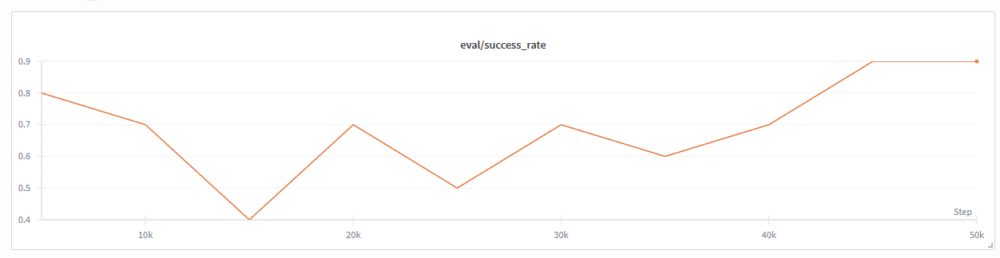

# Experiments Log

This document tracks experiments conducted with the LeRobot simulation and real robot setup.

---

## 2025-12-29

### Experiment 1: Simple Pick and Place (VR Simulation)

**Dataset:** `danbhf/sim_pick_place_20251229_101340`

**Setup:**
- 20 episodes recorded
- Task: Pick up the Duplo block and place it in the bowl
- Recording method: Physical SO100 leader arm controlling MuJoCo simulation via VR
- FPS: 30
- Randomization: ±4cm position, ±180° rotation on Duplo block

**Hardware:**
- Leader arm: SO100 with STS3250 motors on COM8
- VR headset: Meta Quest (via Quest Link)
- Calibration: File-based JSON (`~/.cache/huggingface/lerobot/calibration/`)

**Notes:**
- First successful 20-episode recording session
- VR controller focus issues encountered (workaround: spacebar to recenter view)
- Sim-to-real transfer previously validated on earlier dataset

**Next Steps:**
- [x] Train ACT policy on this dataset
- Test policy in simulation
- Deploy to real follower robot

---

### Experiment 2: ACT Policy Training

**Dataset:** `danbhf/sim_pick_place_20251229_101340` (20 episodes)

**Training Command:**
```bash
python training/train_act.py danbhf/sim_pick_place_20251229_101340 --steps 5000 --batch_size 4
```

**Status:** Training successfully running on CUDA

**Issues Resolved:**

1. **PyTorch CUDA support:** RTX 5090 (Blackwell architecture) requires PyTorch nightly builds with CUDA 12.8+ support.
   ```bash
   pip uninstall torch torchvision
   pip install --pre torch torchvision --index-url https://download.pytorch.org/whl/nightly/cu128
   ```

2. **Tensor dimension mismatch:** ACT model expects `observation.state` to be 2D `[batch, state_dim]`, but LeRobot dataset returns 3D `[batch, n_obs_steps, state_dim]`. Fixed by squeezing the temporal dimension when `n_obs_steps=1`.

**Training Progress (5000 steps test run):**
```
Step    100/5000 | Loss: 10.9634
Step    500/5000 | Loss: 3.0496
Step   1000/5000 | Loss: 2.3347
Step   1500/5000 | Loss: 1.8772
Step   1800/5000 | Loss: 1.7787
```

**Full Training (50000 steps):**
- Model: `outputs/train/act_20251229_111846/final`
- Checkpoints saved every 5000 steps
- WandB logging enabled
- Final model size: ~200MB

**Notes:**
- Loss decreasing steadily - model is learning
- Using both wrist_cam and overhead_cam as input
- Chunk size: 100 (predicts 100 future actions)

---

### Experiment 2b: Additional Recording Session (Lincoln)

**Dataset:** `danbhf/sim_pick_place_20251229_144730`

**Setup:**
- 20 episodes recorded by Lincoln
- Task: Pick up the Duplo block and place it in the bowl
- Same recording setup as Experiment 1
- FPS: 30
- Randomization: ±4cm position, ±180° rotation on Duplo block

**Notes:**
- Second recording session to expand training data
- Combined with Experiment 1 dataset = 40 total episodes

---

### Experiment 3: ACT Policy Evaluation (VR Simulation)

**Model:** `outputs/train/act_20251229_111846/final` (50k steps)

**Evaluation Command:**
```bash
python inference/run_act_sim.py outputs/train/act_20251229_111846/final --no_vr
```

**Setup:**
- Same simulation environment used for recording
- Same randomization: ±4cm position, ±180° rotation
- Max 300 steps per episode (10 seconds at 30fps)
- FPS: 30

**Results (5 episodes):**
```
Episode 1: Task completed at step 92
Episode 2: Task completed at step 120
Episode 3: Task completed at step 110
Episode 4: Task completed at step 102
Episode 5: Timed out after 300 steps

Success rate: 4/5 (80.0%)
Average steps: 144.8
```

**Notes:**
- Policy successfully learned pick-and-place from 20 demonstration episodes
- 80% success rate with full randomization is a strong result
- Failed episode likely due to challenging initial object placement
- Training dataset: `danbhf/sim_pick_place_20251229_101340`

**Next Steps:**
- [ ] Train on combined dataset (40 episodes) for improved robustness
- [ ] Test with different randomization ranges
- [ ] Deploy to real follower robot
- [ ] Try Lincoln's dataset: `danbhf/sim_pick_place_20251229_144730`

---

### Experiment 4: Training with In-Loop Evaluation

**Dataset:** `danbhf/sim_pick_place_20251229_101340` (20 episodes)

**Training Command:**
```bash
python training/train_act.py danbhf/sim_pick_place_20251229_101340 \
    --steps 50000 --eval_episodes 10 --eval_randomize
```

**New Features Added:**
- Simulation evaluation runs after each checkpoint (every 5000 steps)
- Tracks success rate, average steps, and average time per episode
- Logs `eval/success_rate`, `eval/avg_steps`, `eval/avg_time` to WandB
- Enables learning curve visualization (success rate vs training step)

**Inference Improvements:**
- Added timing per episode
- Added optional WandB logging for evaluation runs
- Logs per-episode metrics and summary statistics

**Status:** Complete

**Results:**


| Checkpoint | Success Rate |
|------------|--------------|
| 5k         | 80%          |
| 10k        | 70%          |
| 15k        | 40%          |
| 20k        | 70%          |
| 25k        | 50%          |
| 30k        | 70%          |
| 35k        | 60%          |
| 40k        | 70%          |
| 45k        | 90%          |
| 50k        | 90%          |

**Observations:**
- Model learns task quickly - 80% success at just 5k steps!
- High variance in middle of training (40-70% range)
- Final checkpoint reaches 90% success
- 10 eval episodes per checkpoint may be too few for stable estimates

**Issues:**
- Only 10 evaluation episodes per checkpoint leads to high variance
- Difficult to distinguish real performance differences from noise

---

### Experiment 5: Training with More Evaluation Episodes

**Goal:** Reduce variance in success rate estimates by running more evaluation episodes

**Training Command:**
```bash
python training/train_act.py danbhf/sim_pick_place_20251229_101340 \
    --steps 50000 --eval_episodes 30 --eval_randomize
```

**Changes:**
- Increased from 10 to 30 evaluation episodes per checkpoint
- Should provide more stable/confident success rate estimates
- Estimated ~5 minutes eval time per checkpoint

**Statistical Reasoning:**

For binary outcomes (success/fail), the standard error of a proportion is:

```
SE = sqrt(p × (1-p) / n)
```

Assuming a true success rate of p=0.7 (70%):

| Episodes (n) | Standard Error | 95% Confidence Interval |
|--------------|----------------|-------------------------|
| 10           | √(0.21/10) = 14.5% | ±29% |
| 30           | √(0.21/30) = 8.4%  | ±16% |
| 50           | √(0.21/50) = 6.5%  | ±13% |

With 10 episodes, a measured 70% success rate could actually be anywhere from 41-99% (95% CI).
With 30 episodes, the same measurement narrows to 54-86%.

**Status:** Complete

**Results:**

| Checkpoint | Success Rate | Avg Steps | Avg Time |
|------------|--------------|-----------|----------|
| 5k         | 56.7%        | 191.0     | 0.70s    |
| 10k        | 56.7%        | 194.7     | 0.71s    |
| 15k        | 63.3%        | 178.4     | 0.64s    |
| 20k        | 46.7%        | 210.9     | 0.74s    |
| 25k        | 73.3%        | 158.8     | 0.68s    |
| 30k        | 60.0%        | 183.8     | 0.66s    |
| 35k        | 70.0%        | 163.6     | 0.62s    |
| 40k        | **80.0%**    | 147.4     | 0.54s    |
| 45k        | 46.7%        | 210.3     | 0.77s    |
| 50k        | 63.3%        | 175.4     | 0.64s    |
| Final      | 63.3%        | 176.5     | 0.61s    |

**Training Stats:**
- Total time: 110.8 minutes
- Best loss: 0.0398
- Model: `outputs/train/act_20251230_104530`

**Observations:**
- Best checkpoint was 40k (80% success), not final
- Still significant variance even with 30 eval episodes
- Performance doesn't monotonically improve with more training
- Peak at 40k then drops to 46.7% at 45k - possible overfitting?
- Loss continues to decrease (0.29 → 0.04) but success rate doesn't follow

**Key Insight:** Loss is not a reliable proxy for task success. Evaluation during training is essential!

---

### Experiment 6: Extended Training Run (200k steps)

**Goal:** Train for longer to see if performance improves or plateaus

**Training Command:**
```bash
python training/train_act.py danbhf/sim_pick_place_20251229_101340 \
    --steps 200000 --eval_episodes 30 --eval_randomize
```

**Status:** Complete

**Results:**

| Checkpoint | Success Rate | Avg Steps | Avg Time |
|------------|--------------|-----------|----------|
| 5k         | 26.7%        | 245.6     | 0.89s    |
| 10k        | 10.0%        | 278.6     | 1.01s    |
| 15k        | 36.7%        | 226.2     | 0.83s    |
| 20k        | 26.7%        | 252.4     | 0.93s    |
| 25k        | 56.7%        | 189.8     | 0.73s    |
| 30k        | 40.0%        | 223.9     | 0.82s    |
| 35k        | 46.7%        | 206.6     | 1.24s    |
| 40k        | 43.3%        | 223.7     | 0.95s    |
| 45k        | 53.3%        | 197.1     | 0.77s    |
| 50k        | 60.0%        | 185.5     | 0.69s    |
| 55k        | 60.0%        | 186.5     | 0.66s    |
| 60k        | 43.3%        | 216.1     | 0.75s    |
| 65k        | 30.0%        | 241.1     | 0.82s    |
| 70k        | 66.7%        | 169.2     | 0.58s    |
| 75k        | 63.3%        | 182.6     | 0.64s    |
| **80k**    | **76.7%**    | 155.5     | 0.55s    |
| 85k        | 60.0%        | 184.7     | 0.64s    |
| 90k        | 56.7%        | 191.0     | 0.65s    |
| 95k        | 63.3%        | 178.0     | 0.62s    |
| 100k       | 63.3%        | 176.0     | 0.73s    |
| 105k       | 53.3%        | 198.1     | 0.69s    |
| 110k       | 40.0%        | 222.9     | 0.79s    |
| 115k       | 63.3%        | 176.7     | 0.62s    |
| 120k       | 70.0%        | 168.8     | 0.60s    |
| 125k       | 63.3%        | 182.6     | 0.65s    |
| 130k       | 63.3%        | 178.8     | 0.63s    |
| 135k       | 70.0%        | 164.2     | 0.58s    |
| 140k       | 63.3%        | 180.1     | 0.63s    |
| 145k       | 73.3%        | 161.4     | 0.57s    |
| 150k       | 66.7%        | 172.6     | 0.59s    |
| 155k       | 60.0%        | 184.9     | 0.68s    |
| 160k       | 73.3%        | 167.8     | 0.59s    |
| 165k       | 63.3%        | 180.1     | 0.66s    |
| 170k       | 53.3%        | 198.6     | 0.70s    |
| **175k**   | **76.7%**    | 158.9     | 0.57s    |
| 180k       | 70.0%        | 169.9     | 0.60s    |
| 185k       | 60.0%        | 188.8     | 0.66s    |
| 190k       | 53.3%        | 198.2     | 0.69s    |
| 195k       | 56.7%        | 193.6     | 0.68s    |
| 200k       | 66.7%        | 169.2     | 0.59s    |
| Final      | 60.0%        | 189.4     | 0.66s    |

**Training Stats:**
- Total time: 457.3 minutes (~7.6 hours)
- Best loss: 0.0195
- Model: `outputs/train/act_20251230_125147`

**Key Observations:**
1. **No improvement from longer training** - Best checkpoints were 80k and 175k (both 76.7%), same as 50k run's 80% peak
2. **Performance plateaus around 60-70%** after initial learning phase (~50k steps)
3. **Loss continues to decrease** (0.29 → 0.02) but success rate stays flat
4. **High variance persists** - success rate oscillates ±20% between checkpoints
5. **Slow start** - only 10-27% success in first 20k steps (vs 56-80% in Experiment 5)

**Conclusions:**
- More training steps doesn't help beyond ~50k
- The bottleneck is likely **data quantity/diversity**, not training duration
- 20 episodes may be insufficient for robust generalization
- Random seed differences cause significant run-to-run variation

**Next Steps:**
- [x] Train on combined dataset (40 episodes from both recording sessions)
- [ ] Try data augmentation
- [ ] Investigate why early checkpoints perform differently across runs

---

### Experiment 7: Training on Merged Dataset (40 episodes)

**Goal:** Test if doubling the training data improves performance and reduces variance

**Dataset:** `danbhf/sim_pick_place_merged_40ep`
- 40 episodes (20 from original + 20 from Lincoln)
- 6559 frames total
- Same task: pick up Duplo block, place in bowl

**Training Commands:**
```bash
# 50k steps
python training/train_act.py danbhf/sim_pick_place_merged_40ep --steps 50000 --eval_episodes 30 --eval_randomize

# 200k steps
python training/train_act.py danbhf/sim_pick_place_merged_40ep --steps 200000 --eval_episodes 30 --eval_randomize
```

**Hypothesis:**
- More data should improve peak success rate (>80%)
- More data should reduce variance between checkpoints
- May need fewer training steps to converge

**Status:** Complete (50k), In progress (200k)

**Results (50k run):**

| Checkpoint | Success Rate | Avg Steps | Avg Time |
|------------|--------------|-----------|----------|
| 5k         | 43.3%        | 227.3     | 0.83s    |
| 10k        | 63.3%        | 183.9     | 0.68s    |
| 15k        | 80.0%        | 164.1     | 0.60s    |
| 20k        | 73.3%        | 169.8     | 0.64s    |
| 25k        | 80.0%        | 167.2     | 0.62s    |
| **30k**    | **93.3%**    | 153.5     | 0.58s    |
| 35k        | 76.7%        | 167.0     | 0.61s    |
| 40k        | 86.7%        | 149.2     | 0.57s    |
| 45k        | 90.0%        | 140.1     | 0.52s    |
| 50k        | 80.0%        | 166.5     | 0.63s    |
| Final      | **90.0%**    | 139.6     | 0.49s    |

**Training Stats:**
- Total time: 89.3 minutes
- Best loss: 0.0490
- Model: `outputs/train/act_20251230_235903`

**Key Findings:**
1. **Peak improved from 80% → 93.3%** (30k checkpoint)
2. **Final improved from 60% → 90%**
3. **More consistent** - 6 checkpoints at ≥80% (vs 1-2 with 20 episodes)
4. **Faster convergence** - hit 80% at 15k steps
5. **Less variance** - success rate stays in 73-93% range after 15k

**Conclusion:** Doubling the data significantly improved both peak performance and consistency. The hypothesis was confirmed!

---

### Experiment 8: Larger Batch Size (48)

**Goal:** Test if larger batch size improves training efficiency with more GPU memory available

**Dataset:** `danbhf/sim_pick_place_merged_40ep` (40 episodes)

**Training Command:**
```bash
python training/train_act.py danbhf/sim_pick_place_merged_40ep \
    --steps 50000 --batch_size 48 --eval_episodes 30 --eval_randomize
```

**Results:**

| Checkpoint | Success Rate | Avg Steps | Avg Time |
|------------|--------------|-----------|----------|
| 5k         | 73.3%        | 175.8     | 0.65s    |
| 10k        | 70.0%        | 177.8     | 0.65s    |
| 15k        | 70.0%        | 191.2     | 0.71s    |
| 20k        | 66.7%        | 180.4     | 0.68s    |
| 25k        | 73.3%        | 170.4     | 0.64s    |
| 30k        | 83.3%        | 153.7     | 0.59s    |
| **35k**    | **93.3%**    | 135.0     | 0.53s    |
| 40k        | 80.0%        | 155.3     | 0.59s    |
| 45k        | 80.0%        | 161.6     | 0.63s    |
| 50k        | 76.7%        | 165.6     | 0.65s    |
| Final      | 73.3%        | 173.3     | 0.60s    |

**Training Stats:**
- Total time: 447.0 minutes (~7.5 hours)
- Best loss: 0.0336
- Model: `outputs/train/act_20251231_114817`

**Comparison with Experiment 7 (batch_size 8):**

| Metric | Batch 8 | Batch 48 |
|--------|---------|----------|
| Peak success | 93.3% @ 30k | 93.3% @ 35k |
| Final success | 90.0% | 73.3% |
| Training time | 89 min | 447 min |
| Throughput | ~9 it/s | ~2.5 it/s |

**Key Observations:**

1. **Same peak performance (93.3%)** but at different steps (35k vs 30k)
2. **5x slower training time** despite larger batch size!
3. **Video decoding is the bottleneck** - larger batches need more frames decoded per step
4. **Slightly delayed convergence** - 35k vs 30k peak makes sense (fewer gradient updates with larger batch)
5. **Lower final score** - 73.3% vs 90% suggests the model may have overfit or the random seed affected the final checkpoint

**Root Cause: Data Loading Bottleneck**

The GPU utilization graph showed periodic drops to 0% - the GPU is waiting for video frames to be decoded. With batch_size 48, each step needs 6x more frames decoded than batch_size 8, causing proportionally longer waits.

**Solution:** Use `--cache_dataset` flag to pre-load all frames into memory before training. This eliminates the video decoding bottleneck during training.

---

### Experiment 9: Cached Dataset (50k steps, batch 48)

**Goal:** Test if caching dataset in memory improves training speed

**Training Command:**
```bash
python training/train_act.py danbhf/sim_pick_place_merged_40ep \
    --steps 50000 --batch_size 48 --eval_episodes 30 --eval_randomize --cache_dataset
```

**Caching Stats:**
- Cache time: 2:52 (2 min 52 sec)
- Cache size: 45.05 GB
- Images at full resolution (480×640)

**Results:**

| Checkpoint | Success Rate | Avg Steps | Avg Time |
|------------|--------------|-----------|----------|
| 5k         | 56.7%        | 209.5     | 0.83s    |
| 10k        | 73.3%        | 169.9     | 0.67s    |
| 15k        | 50.0%        | 212.5     | 0.83s    |
| 20k        | 73.3%        | 176.4     | 0.71s    |
| 25k        | 66.7%        | 178.8     | 0.69s    |
| 30k        | 76.7%        | 164.9     | 0.65s    |
| 35k        | 70.0%        | 177.3     | 0.70s    |
| 40k        | 76.7%        | 157.2     | 0.64s    |
| 45k        | 70.0%        | 171.3     | 0.69s    |
| **50k**    | **93.3%**    | 131.1     | 0.52s    |
| Final      | 86.7%        | 146.0     | 0.55s    |

**Training Stats:**
- Total time: 278.2 minutes (~4.6 hours)
- Best loss: 0.0337
- Throughput: ~3.0 it/s
- Model: `outputs/train/act_20260101_024817`

**Caching Speedup Comparison:**

| Metric | Uncached (Exp 8) | Cached (Exp 9) | Speedup |
|--------|------------------|----------------|---------|
| Training time | 447 min | 278 min | **1.6x** |
| Throughput | ~2.5 it/s | ~3.0 it/s | 1.2x |
| Peak success | 93.3% @ 35k | 93.3% @ 50k | Same |

**Observations:**
1. Caching provided **1.6x speedup** (447 → 278 min)
2. Same peak performance (93.3%) achieved
3. 45 GB cache used most of available RAM
4. Throughput improved but not as dramatic as hoped (~3 it/s vs ~2.5 it/s)

---

### Experiment 10: Extended Training with Caching (200k steps, batch 48)

**Goal:** Test if longer training with caching improves performance

**Training Command:**
```bash
python training/train_act.py danbhf/sim_pick_place_merged_40ep \
    --steps 200000 --batch_size 48 --eval_episodes 30 --eval_randomize --cache_dataset
```

**Results:**

| Checkpoint | Success Rate | Avg Steps | Avg Time |
|------------|--------------|-----------|----------|
| 5k         | 56.7%        | 203.6     | 0.79s    |
| 10k        | 60.0%        | 199.6     | 0.77s    |
| 15k        | 60.0%        | 199.0     | 0.81s    |
| 20k        | 63.3%        | 197.1     | 0.78s    |
| 25k        | 73.3%        | 179.2     | 0.71s    |
| 30k        | 73.3%        | 181.8     | 0.72s    |
| 35k        | 70.0%        | 183.8     | 0.72s    |
| 40k        | 70.0%        | 185.8     | 0.73s    |
| 45k        | 73.3%        | 174.4     | 0.69s    |
| 50k        | 66.7%        | 187.1     | 0.74s    |
| 55k        | 70.0%        | 180.0     | 0.69s    |
| 60k        | 66.7%        | 187.5     | 0.70s    |
| 65k        | 76.7%        | 168.4     | 0.63s    |
| 70k        | 70.0%        | 180.0     | 0.68s    |
| 75k        | 70.0%        | 179.3     | 0.68s    |
| 80k        | 73.3%        | 172.6     | 0.65s    |
| 85k        | 70.0%        | 180.9     | 0.68s    |
| 90k        | 60.0%        | 197.1     | 0.75s    |
| 95k        | 63.3%        | 187.6     | 0.70s    |
| 100k       | 56.7%        | 202.1     | 0.77s    |
| 105k       | 80.0%        | 170.1     | 0.64s    |
| 110k       | 80.0%        | 156.9     | 0.63s    |
| 115k       | 73.3%        | 168.3     | 0.64s    |
| 120k       | 70.0%        | 178.9     | 0.67s    |
| 125k       | 83.3%        | 162.5     | 0.61s    |
| 130k       | 80.0%        | 177.7     | 0.68s    |
| 135k       | 76.7%        | 168.1     | 0.63s    |
| 140k       | 70.0%        | 180.5     | 0.68s    |
| 145k       | 80.0%        | 162.1     | 0.62s    |
| 150k       | 80.0%        | 161.9     | 0.62s    |
| 155k       | 66.7%        | 183.8     | 0.69s    |
| 160k       | 76.7%        | 160.5     | 0.61s    |
| **165k**   | **86.7%**    | 152.0     | 0.57s    |
| 170k       | 76.7%        | 168.0     | 0.63s    |
| 175k       | 80.0%        | 156.5     | 0.59s    |
| 180k       | 80.0%        | 168.0     | 0.64s    |
| 185k       | 70.0%        | 179.3     | 0.68s    |
| 190k       | 76.7%        | 169.2     | 0.64s    |
| **195k**   | **86.7%**    | 148.0     | 0.57s    |
| 200k       | 66.7%        | 185.7     | 0.70s    |
| Final      | 66.7%        | 186.0     | 0.71s    |

**Training Stats:**
- Total time: 1108.7 minutes (~18.5 hours)
- Best loss: 0.0163
- Throughput: ~3.0 it/s
- Model: `outputs/train/act_20260101_072954`

**Key Observations:**

1. **Peak only 86.7%** vs 93.3% in the 50k run - worse!
2. **Performance plateaus around 70-80%** from 25k onwards
3. **Significant variance** - swings between 56.7% and 86.7%
4. **Loss keeps decreasing** (0.0338 → 0.0163) but success rate doesn't follow
5. **Dip at 100k** (56.7%) - possible sign of instability

**Comparison Across All Experiments:**

| Experiment | Steps | Batch | Cached | Peak | Final | Time |
|------------|-------|-------|--------|------|-------|------|
| 7 (baseline) | 50k | 8 | No | 93.3% @ 30k | 90.0% | 89 min |
| 8 | 50k | 48 | No | 93.3% @ 35k | 73.3% | 447 min |
| 9 | 50k | 48 | Yes | 93.3% @ 50k | 86.7% | 278 min |
| 10 | 200k | 48 | Yes | 86.7% @ 165k | 66.7% | 1109 min |

**Conclusions:**

1. **Training beyond 50k steps provides no benefit** - peak stays at ~93%
2. **Batch size 8 remains optimal** for this dataset size (89 min, 90% final)
3. **Larger batches hurt final performance** despite same peak
4. **Caching helps** (1.6x speedup) but doesn't change the fundamental limits
5. **The bottleneck is data quantity**, not training time or batch size

**Recommendations:**
- Use batch_size 8 for best results with 40 episodes
- 50k steps is sufficient
- Focus on collecting more demonstrations rather than longer training
- Consider data augmentation to artificially expand dataset

---

### Analysis: Why Did Batch Size 8 Outperform Batch Size 48?

Several factors likely contributed to batch size 8 performing better:

#### 1. Learning Rate Wasn't Scaled (Most Likely Cause)

The "linear scaling rule" suggests: if batch size increases by k×, learning rate should also increase by k×.

| Batch Size | LR Used | LR Should Be |
|------------|---------|--------------|
| 8 | 1e-5 | 1e-5 (baseline) |
| 48 | 1e-5 | **6e-5** |

With the same LR, batch 48 effectively had a 6× smaller learning rate relative to what it needed.

#### 2. Gradient Noise as Regularization

- Smaller batches → noisier gradients → implicit regularization
- Helps escape sharp minima, finds flatter minima that generalize better
- With batch 48, gradients are too "clean" and may converge to sharp minima

#### 3. Effective Epochs (Potential Overfitting)

| Batch Size | Steps | Samples Seen | Epochs |
|------------|-------|--------------|--------|
| 8 | 50k | 400,000 | ~61 |
| 48 | 50k | 2,400,000 | ~366 |

Batch 48 saw each example 6× more times, potentially leading to overfitting on only 40 episodes.

#### 4. Small Dataset Problem

With only 6,559 frames, smaller batches provide more frequent weight updates and better exploration of the loss landscape. The ML consensus is that smaller batches work better for small datasets.

#### LR Scheduler: CosineAnnealingLR

The training uses cosine annealing: starts at initial LR and smoothly decays to 1e-7 over the training run. This works well but requires the initial LR to be properly scaled for the batch size.

---

### Experiment 11: Scaled Learning Rate for Batch 48

**Goal:** Test if scaling LR with batch size improves performance

**Hypothesis:** With LR=6e-5 (6× baseline), batch 48 should match or exceed batch 8 performance.

**Training Command:**
```bash
python training/train_act.py danbhf/sim_pick_place_merged_40ep \
    --steps 50000 --batch_size 48 --lr 6e-5 --eval_episodes 30 --eval_randomize --cache_dataset
```

**Status:** Complete

**Results:**

| Checkpoint | Success Rate | Avg Steps | Avg Time |
|------------|--------------|-----------|----------|
| 5k         | 76.7%        | 162.7     | 0.65s    |
| 10k        | 70.0%        | 183.1     | 0.72s    |
| 15k        | 80.0%        | 164.4     | 0.64s    |
| 20k        | 66.7%        | 177.6     | 0.74s    |
| 25k        | 66.7%        | 184.6     | 0.88s    |
| 30k        | 66.7%        | 184.3     | 0.73s    |
| **35k**    | **90.0%**    | 139.7     | 0.56s    |
| **40k**    | **90.0%**    | 142.5     | 0.57s    |
| 45k        | 76.7%        | 162.7     | 0.64s    |
| 50k        | 73.3%        | 175.3     | 0.71s    |
| Final      | 70.0%        | 172.0     | 0.65s    |

**Training Stats:**
- Total time: 278.4 minutes (~4.6 hours)
- Best loss: 0.0148
- Model: `outputs/train/act_20260102_105104`

**Comparison - Did Scaling LR Help?**

| Experiment | Batch | LR | Peak | Final | Time |
|------------|-------|-----|------|-------|------|
| 7 (baseline) | 8 | 1e-5 | **93.3%** @ 30k | **90.0%** | **89 min** |
| 9 | 48 | 1e-5 | **93.3%** @ 50k | 86.7% | 278 min |
| 11 | 48 | 6e-5 | 90.0% @ 35k | 70.0% | 278 min |

**Conclusion: Scaling LR did NOT help - it actually made results worse!**

- Peak dropped from 93.3% to 90.0%
- Final dropped from 86.7% to 70.0%
- The linear scaling rule doesn't apply well here

**Why the Linear Scaling Rule Failed:**

1. **Small dataset** - Only 40 episodes / 6559 frames. The rule was developed for ImageNet-scale datasets.
2. **CosineAnnealingLR already handles decay** - Higher initial LR decays too aggressively
3. **Model sensitivity** - Transformers can be sensitive to learning rate
4. **Batch size 8 is optimal** - For this dataset size, smaller batches with more gradient updates work better

**Time Comparison:**

| Batch Size | Cached | Time | vs Batch 8 |
|------------|--------|------|------------|
| 8 | No | 89 min | baseline |
| 48 | No | 447 min | 5.0x slower |
| 48 | Yes | 278 min | **3.1x slower** |

Even with caching, batch 48 is significantly slower than batch 8 because:
- Fewer gradient updates per epoch
- More data loaded per step
- Batch 8's video decoding doesn't bottleneck on this dataset size

**Final Recommendation:** Use batch_size 8 with lr=1e-5 for best results on small datasets (~40 episodes)

---

## 2026-01-02

### Experiment 12: End-Effector Action Space Dataset Creation

**Goal:** Convert existing joint-space dataset to end-effector action space using FK, enabling training with spatial (xyz + quaternion) actions.

**Datasets:**
- Input: `danbhf/sim_pick_place_merged_40ep` (40 episodes, 6559 frames, 6-dim joint actions)
- Output: `danbhf/sim_pick_place_merged_40ep_ee` (same episodes, 8-dim EE actions)

**Action Space Conversion:**

| Joint Space (Original) | End-Effector Space (New) |
|------------------------|--------------------------|
| 6 values: joint angles (normalized -100 to +100) | 8 values: xyz (3) + quaternion (4) + gripper (1) |
| Direct motor commands | Spatial pose representation |
| Robot-specific | More transferable |

**Implementation:**

1. **Forward Kinematics (FK):** MuJoCo-based FK using `mj_kinematics()` to compute end-effector site position and rotation matrix from joint angles.

2. **Inverse Kinematics (IK):** Damped least-squares Jacobian-based IK solver for converting EE pose back to joint angles during inference.

3. **Quaternion Representation:** Rotation matrix → quaternion [qw, qx, qy, qz] using Shepperd's method.

**FK/IK Roundtrip Validation:**

```
Frame 0 [EE → IK]:
  Target pos: [0.1759, -0.0004, 0.0193]
  Actual pos: [0.1769, -0.0004, 0.0193]
  Pos error:  [0.0010, 0.0000, 0.0000]  (~1mm)
  Target quat: [0.610, -0.636, 0.315, 0.354]
  Actual quat: [0.608, -0.633, 0.319, 0.357]

IK success rate: 100%
```

**Key Results:**
- **Position error:** ~1mm (0.001m) - excellent accuracy
- **Quaternion error:** ~0.003-0.004 - minimal rotation drift
- **IK convergence:** 100% success rate across all frames
- **Per-episode scene data preserved:** Duplo positions correctly loaded per episode

**Scripts Created:**
- `scripts/test_fk_ik.py` - FK/IK module with MuJoCo backend
- `scripts/teleop_ee_sim.py` - EE-space teleop with real-time IK
- `recording/convert_to_ee_actions.py` - Dataset conversion utility
- `recording/playback_ee_sim.py` - EE dataset playback with IK

**Merge Script Updates:**
- `scripts/merge_datasets.py` now preserves:
  - `episode_scenes.json` - Per-episode object positions (duplo, bowl)
  - `recording_metadata.json` - Calibration and recording info

**Dataset Features:**
```json
{
  "action": {"shape": [8], "names": ["ee.x", "ee.y", "ee.z", "ee.qw", "ee.qx", "ee.qy", "ee.qz", "gripper.pos"]},
  "action_joints": {"shape": [6], "description": "Original joint actions for comparison"}
}
```

**Status:** Complete

---

### Experiment 13: Joint-Space Baseline with Batch 16 (Cached)

**Goal:** Establish baseline for comparison with EE action space training

**Dataset:** `danbhf/sim_pick_place_merged_40ep` (6-dim joint actions)

**Training Command:**
```bash
python training/train_act.py danbhf/sim_pick_place_merged_40ep \
    --steps 50000 --batch_size 16 --eval_episodes 30 --eval_randomize --cache_dataset
```

**Status:** Complete

**Results:**

| Checkpoint | Success Rate | Avg Steps | Avg Time |
|------------|--------------|-----------|----------|
| 5k         | 60.0%        | 199.5     | 0.80s    |
| 10k        | 66.7%        | 188.5     | 0.78s    |
| **15k**    | **90.0%**    | 149.2     | 0.60s    |
| 20k        | 73.3%        | 170.8     | 0.69s    |
| 25k        | 60.0%        | 198.4     | 0.87s    |
| 30k        | 70.0%        | 178.2     | 0.70s    |
| 35k        | 80.0%        | 161.8     | 0.64s    |
| 40k        | 73.3%        | 166.0     | 0.65s    |
| 45k        | 60.0%        | 202.7     | 0.80s    |
| 50k        | 73.3%        | 173.6     | 0.68s    |
| Final      | 63.3%        | 199.5     | 0.75s    |

**Training Stats:**
- Total time: 104.6 minutes
- Best loss: 0.0387
- Cache time: ~2.5 minutes
- Cache size: 45.05 GB
- Model: `outputs/train/act_20260102_155225`

**Key Observations:**
1. **Peak at 15k (90%)** - then performance drops, possible overfitting
2. **Final only 63.3%** - significant drop from peak
3. **High variance** - swings between 60-90% across checkpoints
4. **Batch 16 is middle ground** - faster than batch 8, more stable than batch 48

**Comparison with Previous Batch Sizes:**

| Batch | LR | Cached | Peak | Final | Time |
|-------|-----|--------|------|-------|------|
| 8 | 1e-5 | No | 93.3% @ 30k | 90.0% | 89 min |
| 16 | 1e-5 | Yes | **90.0% @ 15k** | 63.3% | 105 min |
| 48 | 1e-5 | Yes | 93.3% @ 50k | 86.7% | 278 min |

**Conclusion:** Batch 16 converges fastest (peak at 15k) but has worse generalization (lower final). Batch 8 remains best overall for this dataset size.

---

### Experiment 14: ACT Training with End-Effector Action Space

**Goal:** Train ACT policy to predict end-effector pose instead of joint angles

**Dataset:** `danbhf/sim_pick_place_merged_40ep_ee` (8-dim EE actions)

**Training Command:**
```bash
python training/train_act.py danbhf/sim_pick_place_merged_40ep_ee \
    --steps 50000 --batch_size 16 --eval_episodes 30 --eval_randomize --cache_dataset
```

**Status:** Starting...

---

## Future Experiments

### Planned: End-Effector Action Space with FK/IK

**Status:** Completed in Experiment 12!

**Implementation Phases:**
- [x] Phase 1: Teleop in simulation with FK/IK pipeline
- [ ] Phase 2: Teleop on real robot with FK/IK
- [x] Phase 3: Train ACT in end-effector action space (Experiment 13)
- [ ] Phase 4: Add learnable IK module to model head (end-to-end)

**FK/IK Module Options:**

| Library | Pros | Cons | Recommendation |
|---------|------|------|----------------|
| **MuJoCo built-in** | Already using MuJoCo, fast, accurate | Requires Jacobian-based IK | Good for sim |
| **ikpy** | Pure Python, easy URDF loading, simple API | Slower than compiled solutions | **Best for prototyping** |
| **roboticstoolbox-python** | Comprehensive, Peter Corke's library | Steeper learning curve | Good for research |
| **PyBullet** | Built-in IK, good for sim | Another sim dependency | Alternative |
| **Analytical IK** | Fastest, exact for 6-DOF | Requires derivation per robot | Best for production |

**Recommended Setup:**
```bash
pip install ikpy roboticstoolbox-python
```

**Action Space Comparison:**

| Current (Joint Space) | Proposed (End-Effector Space) |
|-----------------------|-------------------------------|
| 6 values: joint angles | 8 values: xyz (3) + quat (4) + gripper (1) |
| Direct motor control | Requires IK at inference |
| Robot-specific | More transferable |
| Harder to visualize | Intuitive spatial meaning |

---

### Planned: Alternative Camera Angles

**Motivation:** Test if different viewpoints improve policy learning

**Approach:**
1. **Replay existing data** through MuJoCo with different camera positions
2. Generate new dataset with same trajectories but different views
3. Compare training performance

**Camera angles to try:**
- [ ] Higher overhead angle (more top-down)
- [ ] Side view (orthogonal to current)
- [ ] Lower wrist cam angle
- [ ] Third-person view (behind robot)

**Implementation:**
- Modify scene XML to add new camera positions
- Create replay script that loads recorded joint trajectories and re-renders with new cameras
- No need to re-record demonstrations

---

### Planned: RealSense D435 Depth Camera

**Motivation:** Depth information could help with:
- Better spatial understanding
- Occlusion handling
- Distance estimation for grasping

**Approach:**
1. Add D435 to simulation (depth rendering in MuJoCo)
2. Record new dataset with RGB-D
3. Modify ACT input to include depth channel
4. Compare performance with RGB-only

**Input options:**
- RGB + separate depth channel (4 channels)
- RGB-D stacked (4 channels)
- Point cloud input (would need architecture change)
- Depth as additional "camera" input

**Hardware:** RealSense D435 specifications
- RGB: 1920×1080 @ 30fps
- Depth: 1280×720 @ 90fps (or 848×480 @ 90fps)
- Range: 0.2m - 10m
- Good for tabletop manipulation

---
